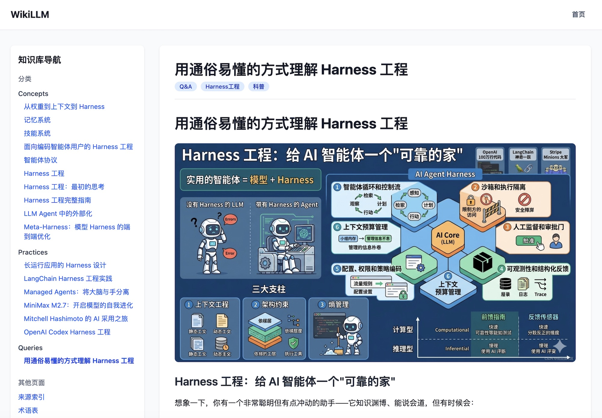
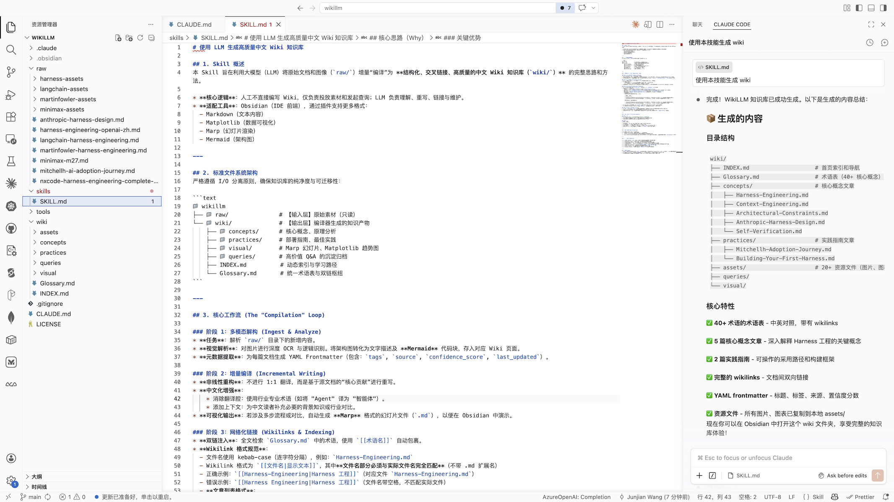

# WikiLLM

利用 LLM 构建个人知识库和项目推进系统。WikiLLM 将原始素材"编译"成结构化、交叉链接的高质量中文 Wiki，同时支持基于个人想法推进项目思考。

本项目基于 **Andrej Karpathy** 提出的理念构建。详见：[LLM Knowledge Bases](https://x.com/karpathy/status/2039805659525644595)

## 系统架构

```text
wikillm/
├── raw/                      # 事实来源（不可变）
│   └── images/
├── ideas/                    # 人的动态输入（按项目/置信度分）
│   └── <project>/
│       ├── verified/         # 已验证
│       ├── referenced/       # 引述
│       ├── hypothesized/     # 猜想
│       ├── inspired/         # 灵感
│       └── *.md              # 未分类
├── thinking/                 # 模型草稿（按主题分，临时，完成后编译并删除）
│   └── <topic>/
├── wiki/                     # 编译后的知识库（可检索）
│   ├── concepts/             # 核心概念（从 raw 编译 → "是什么"）
│   ├── practices/            # 实践指南（从 raw 编译 → "怎么做"）
│   ├── queries/              # 会话沉淀（来源核查后 → "事实"）
│   ├── visual/               # 可视化内容
│   ├── assets/               # 图像和资源文件
│   ├── INDEX.md              # 首页索引
│   └── Glossary.md           # 术语表
└── projects/                 # 项目规律综合（从 ideas + wiki 编译）
    └── <project>/
        ├── exploring/        # 探索
        ├── planning/         # 规划
        ├── advancing/        # 推进
        ├── validating/       # 验证
        └── concluded/        # 定论
```

### 三层隔离

| 层 | 目录 | 可检索 | 生命周期 |
|---|---|---|---|
| 输入层 | `raw/` | 编译时读取 | 永久 |
| 草稿层 | `thinking/` | 不检索 | 完成后编译并删除 |
| 输出层 | `wiki/`、`projects/` | Q&A 和 Linting 时检索 | 永久 |

## 两个 Skill

### wikillm — 纯可信知识

处理事实性知识的编译和查询：

1. **增量编译**（raw/ → wiki/）
   - 触发：用户说"wiki编译" / raw/ 哈希变化 / thinking 编译完成
   - 扫描 raw/ 目录，哈希对比检测新增/修改文件
   - 多模态解构：大文档完整阅读、图片 OCR 转 Mermaid
   - 非线性重构重写为中文化 wiki 文章
   - 按内容性质分目录：concepts/（是什么）、practices/（怎么做）
   - 资源同步：raw/images/ → wiki/assets/

2. **thinking/ 管理**（对话 → 草稿 → wiki）
   - 写入：对话中产生有价值思考 → 写入 thinking/ 按主题分的子目录
   - 话题开始（自动检测）：产生有价值思考 → 自动在 thinking/ 下创建子目录
   - 话题结束：用户说"话题结束" → 立即触发编译；用户未说但对话主题已切换 → 自动检测并触发编译
   - 两阶段编译：价值判断 → 佐证核查（回 raw/ 查佐证）
   - 无法佐证 → 留在 thinking/，不编译；编译完成 → 删除子目录

3. **Q&A**（基于 wiki 的知识查询）
   - 检索范围：raw/ + wiki/，不含 thinking/
   - 回答后提供"参考依据"，列出支撑结论的 wiki 文档

4. **queries/ 会话沉淀**
   - Q&A 中产生有价值且经来源核查的结论 → 写入 wiki/queries/
   - 必须有 wiki/ 或 raw/ 中的具体来源支撑
   - 视同事实，与 concepts/practices 平级

5. **网络化链接**
   - Wikilink 格式规范、双链注入、反向链接、动态索引更新

6. **Linting**（健康检查）
   - 术语一致性检查、孤岛页面扫描
   - thinking/ 停留检查（超 30 天提示）、编译残留检查
   - queries/ 来源核查、raw/ 更新时发布补丁

### ideallm — 推进个人想法

基于知识和个人想法推进项目：

1. **ideas/ 管理**（人的动态输入）
   - 按项目建子目录，四个置信度分类：verified/referenced/hypothesized/inspired
   - 未分类文件：Linting 时扫描，向用户引导归类
   - ideas/ 文件是动态的，用户会持续修改

2. **thinking/ 管理**（对话 → 草稿 → projects）
   - 写入：对话中产生有价值思考 → 写入 thinking/ 按主题分的子目录
   - 话题开始（自动检测）：产生有价值思考 → 自动在 thinking/ 下创建子目录
   - 话题结束：用户说"话题结束" → 立即触发编译；用户未说但对话主题已切换 → 自动检测并触发编译
   - 两阶段编译：价值判断 → 佐证核查（在 wiki/ 和 ideas/ 中查佐证）
   - 佐证来源分级：wiki/ 或 ideas/verified/ → 可编译；ideas/referenced/ 或 hypothesized/ → 需标明层级；无佐证 → 留在 thinking/，不编译
   - 编译完成后删除 thinking/ 子目录

3. **项目 Q&A**
   - 检索范围：wiki/ + ideas/，不含 thinking/
   - 回答后提供"参考依据"，区分来源层级（知识库/已验证/引述/猜想）

4. **projects/ 项目综合**（ideas + wiki → 项目规律）
   - 触发：用户说"idea编译" / thinking 编译完成 / ideas/ 哈希变化 / wiki/ 发生变化
   - 五个阶段目录：exploring → planning → advancing → validating → concluded
   - 阶段可前进也可回退，回退时记录原因
   - 每个项目有 STATUS.md 记录当前阶段和阶段历史
   - concluded/ 中的结论可被其他项目引用

5. **Linting**（健康检查）
   - ideas/ 未分类扫描 + 归类引导
   - thinking/ 停留检查、编译残留检查
   - 项目阶段完整性检查、停滞检查
   - 低置信度引用检查

## 核心原则

- **LLM 编写和维护 wiki 数据**；手动编辑很少见
- **用户想法和查询被归档回系统**以增强知识库和项目
- **可信度由目录位置决定**，不使用额外元数据标注
- **系统专注于 markdown 文件和 Obsidian 兼容格式**
- **图像被下载到本地**以便 LLM 轻松引用

## 当前内容

本 wiki 当前包含关于 **Harness Engineering** 的综合知识库，基于以下来源编译：

- [Externalization in LLM Agents: 智能体记忆/技能/协议/Harness工程统一综述](https://arxiv.org/html/2604.08224v1)
- [Meta-Harness: 模型Harness的端到端优化](https://arxiv.org/html/2603.28052v1)
- [Anthropic: 托管智能体的架构设计：脑手分离](https://www.anthropic.com/engineering/managed-agents)
- [Anthropic: 长生命周期应用的Harness设计](https://www.anthropic.com/engineering/harness-design-long-running-apps)
- [OpenAI: 智能体优先世界中的Codex Harness工程](https://openai.com/zh-Hans-CN/index/harness-engineering/)
- [OpenAI: 英文原版Harness工程指南](https://openai.com/index/harness-engineering/)
- [MiniMax M2.7 模型自我进化发布公告](https://www.minimaxi.com/news/minimax-m27-zh)
- [RedHat: AI辅助开发的结构化Harness工作流](https://developers.redhat.com/articles/2026/04/07/harness-engineering-structured-workflows-ai-assisted-development#the_fix__a_two_phase_workflow)
- [Mitchell Hashimoto (HashiCorp创始人)的AI应用落地历程](https://mitchellh.com/writing/my-ai-adoption-journey)
- [NxCode: Harness工程完整指南 2026](https://www.nxcode.io/resources/news/harness-engineering-complete-guide-ai-agent-codex-2026)
- [LangChain: 基于Harness工程优化深度智能体](https://blog.langchain.com/improving-deep-agents-with-harness-engineering/)
- [Martin Fowler: 编码智能体用户的Harness工程实践](https://martinfowler.com/articles/harness-engineering.html)
- [Martin Fowler: Harness工程早期思考笔记](https://martinfowler.com/articles/exploring-gen-ai/harness-engineering-memo.html)

## 快速开始

### 在 Obsidian 中查看

1. 下载并安装 [Obsidian](https://obsidian.md/)
2. 在 Obsidian 中打开本仓库作为 vault
3. 从 `wiki/INDEX.md` 开始探索


### 在 Web 浏览器中查看

本项目包含一个 Next.js Web 应用，用于在浏览器中查看知识库：

```bash
cd web
npm install
npm run dev
```

然后访问 http://localhost:3000 即可查看。



**Web 应用功能：**
- Markdown 渲染，支持 GFM 格式
- Obsidian 风格 wiki 链接解析（`[[Page|Label]]`）
- 侧边栏导航，按分类组织页面
- 图片资源支持
- 响应式设计

### 使用 Skill

本项目包含两个 Claude Code Skill：

```bash
# 在 Claude Code 中 — 编译事实知识
/wikillm

# 在 Claude Code 中 — 推进项目想法
/ideallm
```



项目修改自https://github.com/wang-junjian/wikillm

## 许可证

MIT License - 详见 [LICENSE](LICENSE) 文件。
