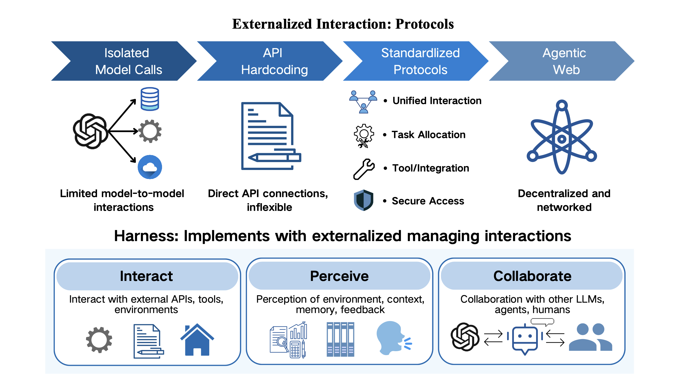

# 智能体协议

**协议外部化**解决了智能体的交互负担问题。它定义了用于发现、调用、委托和权限管理的显式机器可读契约，而不是依赖临时提示级别的与工具、服务和其他智能体的协调。

## 协议外部化的四大维度

### 1. 调用语法

每个工具调用、API 请求或委托消息都需要一种格式：参数名称、类型、排序和返回结构。

- **没有协议**，模型必须在每次调用时推断或重新发明这种语法
- **协议外部化**将其化为模式和类型化接口，因此模型填充字段而不是猜测语法

### 2. 生命周期语义

多步交互需要协调：谁接下来行动，允许什么状态转换，任务何时完成或失败。

- **协议外部化**将这些排序规则化为显式状态机或事件流
- **从模型的推理负担中移除它们**

### 3. 权限和信任边界

现实世界的智能体行为受到谁被授权、数据可以流向哪里以及必须产生什么证据的限制。

- **协议外部化**将这些约束化为可检查的规则，运行时可以强制执行
- **而不是依赖模型自我监督**

### 4. 发现元数据

在智能体可以与工具或另一个智能体交互之前，它必须知道有哪些能力可用以及如何到达它们。

- **协议外部化**将此发现问题化为注册表、能力卡和模式端点
- **用可查询的元数据替换隐含的提示嵌入知识**

## 为什么协议重要

Agent 协议的重要性直接源于它们外部化的负担：没有它们，每次交互部分都是关于格式、合法性和协调的推理问题。

### 统一的交互标准

协议为工具、智能体和前端提供了用于发现、调用、移交和状态交换的共享语法。

- **没有该层**，生态系统会分裂为局部提示加解析器集成
- **标准化交互使互操作性成为设计属性**，而不是幸运的意外
- **稳定多智能体协作的先决条件**

### 改进的安全性、治理和可审计性

一旦智能体在现实环境中运行，问题不仅是它们是否可以行动，还有这些行动是否保持有界、可检查和可恢复。

- **协议通过使权限、身份、执行轨迹、失败状态和责任边界显式化来提供帮助**
- **将以前隐含的粘合逻辑转化为运行时可以验证和操作员可以审计的东西**

### 减少的供应商依赖

开放的交互契约还保留了架构灵活性。

- **如果系统在协议层累积能力**，而不是在供应商特定的接口内，模型、供应商和运行时组件可以用更少的重新布线交换
- **协议不仅是工程便利；它们是智能体生态系统随时间保持可移植和可演化的机制的一部分**

## Agent 协议系列

### 1. Agent-Tool 协议

Agent-Tool 协议是最早成熟的协议系列之一，因为工具访问是接口碎片化首先出现的地方。

**MCP (Model Context Protocol)** 是最清晰的代表：
- 提供标准化方式让智能体发现工具、检查其模式并跨异构服务调用它们
- 通过 JSON-RPC 2.0 公开工具和上下文资源
- 将工具生态系统与模型供应商特定的函数调用格式解耦

### 2. Agent-Agent 协议

一旦多个智能体协作，交互本身就成为系统问题。Agent-Agent 协议定义能力如何被发现、任务如何被委托、进度和部分状态如何被交换以及结果如何返回给调用者。

**代表性协议**：
- **A2A** - 标准化通过 Agent Card 等人工制品进行的能力发现，并支持异构智能体之间的面向任务的通信、状态更新、协商和流式进度
- **ACP** - 通过熟悉的 REST/HTTP 模式强调轻量级采用
- **ANP** - 推动相反方向，目标是具有去中心化身份、跨域发现和安全端到端通信的开放、互联网级互操作性

### 3. Agent-User 协议

Agent-User 协议形式化了智能体运行时和面向用户的系统之间的边界。

**两个主要方向**：
1. **A2UI** - 允许智能体以约束的声明格式描述 UI 结构，主机应用程序可以跨平台安全地呈现
2. **AG-UI** - 标准化类型化执行事件，如运行开始、文本发射、工具调用参数、工具调用结果、完成和错误

### 4. 其他协议

除了一般交互系列外，一些协议还针对通用接口不够的高风险垂直工作流。

- **UCP (Universal Commerce Protocol)** - 为智能体商务做这件事，标准化目录、请求和结账流程
- **AP2 (Agent Payments Protocol)** - 为支付做同样的事，强调授权、签名、可审计性和承载证明的事务对象

## Harness 工程中的 Agent 协议

如果上面的调查显示哪些交互负担在生态系统中被外部化，Harness 工程显示这些协议表面一旦智能体嵌入运行时如何成为运行智能体的一部分。

### 意图捕获和规范化

意图捕获和规范化是这些表面中的第一个。该层的工作是将模型产生的语言转换为运行时可以验证和采取行动的显式命令或事件。

### 能力发现和工具描述

能力发现和工具描述形成第二个表面。在较旧的系统中，可用工具的知识通常部分存在于提示中，部分存在于开发者假设中。协议化发现用显式元数据替换了这一点。

### 会话和生命周期管理

Harness 协议还需要显式的会话和生命周期管理，因为长视野智能体不会作为孤立的单调用运行。

## 协议作为认知人工制品

协议为交互执行这一点。没有它们，每个外部行动部分都是自然语言推理问题：模型必须推断预期的操作，猜测正确的格式，重建可接受的约束，并希望接收系统正确解释结果。

**协议用有界的结构化任务替换了那种开放式推理**：
- 填充类型化字段
- 遵循声明的状态转换
- 接收结构化反馈

> **模型仍然需要关于是否以及何时行动的判断，但它不再需要在每个步骤上重新发明交互的语法和语义。**

## 相关研究

- [[Externalization-in-LLM-Agents|LLM Agent 中的外部化]]
- [[Harness-Engineering|Harness 工程]]
- [[Skill-Systems|技能系统]]
