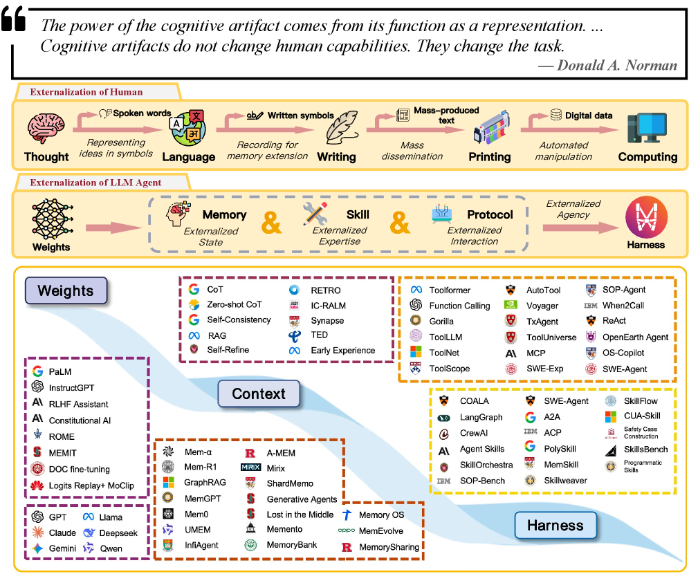

# LLM Agent 中的外部化

**外部化 (Externalization)** 是 LLM Agent 设计的核心组织原则。它指的是将认知负担从模型的内部计算逐步迁移到持久、可检查和可重用的外部结构中的过程。

## 核心论点

本文的中心论点是：**外部化是统一近期 LLM Agent 在记忆、技能、协议和 Harness 工程方面进展的过渡逻辑**。

这不仅仅是一个关于工程便利性的主张，更是一个关于可靠智能体来源的主张：可靠的智能体不仅来自更强大的模型，还来自对任务需求的系统性重组，使得内部能力和外部基础设施共同覆盖所需的全部能力范围。

## 人类认知外部化的平行

人类文明史可以被解读为认知外部化的历史：

1. **语言** - 将私人思想转化为可共享的符号形式
2. **文字** - 将知识从脆弱的生物记忆转移到持久的物质记录
3. **印刷术** - 在社会规模上机械化知识的再生产
4. **数字计算** - 将算术和符号操作从神经劳动转移到可编程机器

在这些转变中，关键的变化不是人类在没有人工制品的情况下能力下降了，而是人工制品通过将选定的负担向外转移，释放了有限的内部资源用于规划、抽象和创造力。

## 认知人工制品理论

这一视角在**认知人工制品 (cognitive artifacts)** 思想中有着自然的理论锚点。中心洞见是：外部辅助工具不仅仅是放大不变的内部能力，它们经常改变任务本身。

- **购物清单** 不扩展生物记忆容量，它将困难的回忆问题转化为识别问题
- **地图** 不简单地使导航"更强"，它将隐藏的空间关系转化为可见的结构

人工制品的力量在于**表征转换**：它重组了问题，使智能体能够用它已经拥有的能力更可靠地解决问题。

## LLM Agent 的三大外部化维度

LLM Agent 通过三个不同但相互耦合的外部化维度实现可靠的智能：

### 1. 记忆系统：跨时间外部化状态

记忆系统允许积累的知识——用户偏好、先前轨迹、已解决的歧义、领域事实——在单个会话之外持续存在，并在相关时被选择性检索。

**核心转换**：从回忆到识别——智能体不再需要从潜在权重中再生过去的知识；它从持久、可搜索的存储中检索。

记忆的四个维度：
- **工作上下文** - 当前任务的实时中间状态
- **情景经验** - 记录先前运行中发生的事情
- **语义知识** - 存储在任何单个情节之外都存在的抽象
- **个性化记忆** - 跟踪关于特定用户、团队或环境的稳定信息

### 2. 技能系统：外部化程序专长

技能系统将程序、最佳实践和操作指导打包成可重用的人工制品，而不是依赖模型的权重在每次调用时重新生成特定任务的知识。

**核心转换**：从生成到组合——智能体从预先验证的组件组装行为，而不是从头即兴创作每个步骤。

技能的三个组成部分：
- **操作程序** - 任务骨架：将复杂工作分解为步骤、阶段、依赖关系和停止条件
- **决策启发式** - 管理分支处发生的情况
- **规范性约束** - 程序被视为可接受的条件

### 3. 协议：外部化交互结构

协议定义了用于发现、调用、委托和权限管理的显式机器可读契约，而不是依赖临时提示级别的与工具、服务和其他智能体的协调。

**核心转换**：从临时到结构化——模糊、脆弱的通信变得可互操作、可治理的交换。

协议外部化的四个维度：
- **调用语法** - 每个工具调用、API 请求或委托消息都需要一种格式
- **生命周期语义** - 多步交互需要协调
- **权限和信任边界** - 现实世界的智能体行为受到谁被授权的限制
- **发现元数据** - 在智能体可以与工具或另一个智能体交互之前，它必须知道有哪些能力可用

## Harness 作为统一层

Harness 是承载所有三个维度并提供编排逻辑、约束、可观测性和反馈循环的工程层，使外部化认知在实践中连贯一致。

Harness 的六大分析维度：
1. **智能体循环和控制流** - 智能体循环是 Harness 的时间骨干
2. **沙箱和执行隔离** - 创建受控的执行边界
3. **人工监督和审批门** - 在智能体循环中插入干预点
4. **可观测性和结构化反馈** - 使智能体的内部轨迹对开发者、操作员和智能体本身可见
5. **配置、权限和策略编码** - 编码不仅是智能体可以做什么，还有它在什么条件下被允许做什么
6. **上下文预算管理** - 上下文窗口仍然是任何智能体系统中最稀缺的共享资源

## 相关研究

- [[Harness-Engineering|Harness 工程]]
- [[Memory-Systems|记忆系统]]
- [[Skill-Systems|技能系统]]
- [[Agent-Protocols|智能体协议]]

## 参考文档

- 原始论文：Externalization in LLM Agents: A Unified Review of Memory, Skills, Protocols and Harness Engineering
