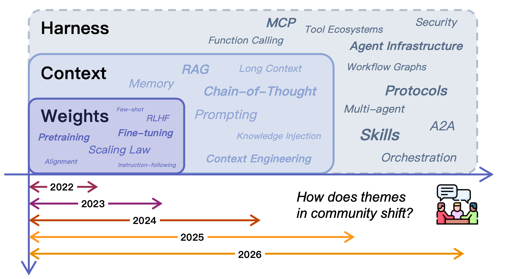

# 从权重到上下文到 Harness

LLM Agent 的近期历史可以被理解为从模型本身逐步向外移动的过程。能力首先被视为权重的属性，然后被视为提示和上下文窗口的属性，现在越来越被视为模型运行所在的更广泛基础设施的属性。

## 能力在权重中

Weights 层对应于现代 LLM 部署的最早浪潮，其中能力几乎完全与模型参数等同。

### 核心优势

- **快速推理**，无需外部查找
- **紧凑部署**
- **在许多任务中强大的泛化**，无需特定任务的管道

### 限制

- **知识、程序和策略与静态人工制品耦合太紧**
- **更新单个事实需要重新训练、知识编辑或通过额外对齐层进行修补**
- **审计为什么模型以某种方式表现很困难**，因为相关知识分布在数十亿个参数上
- **个性化很尴尬** - 单一权重集被要求为数百万具有不同历史、偏好和约束的用户服务

> **参数知识的中心限制是难以选择性地更新、组合和治理。**

## 能力在上下文中

Context 层代表了注意力从模型修改转向输入设计的阶段。

### 关键发展

- **提示工程** 证明了模型行为可以在不接触权重的情况下大幅改变
- **思维链 (Chain-of-Thought)** 使中间推理显式化
- **ReAct** 在单个生成循环中将推理轨迹与工具行动交错
- **思想树 (Tree of Thoughts)** 将思维链推广为对中间推理状态的刻意搜索
- **Self-Refine** 引入了迭代自我批评
- **检索增强生成 (RAG)** 通过在查询时动态将外部文档注入上下文，引入了更系统的外部化形式

### 优势

- **更灵活的 Agent 设计**
- **开发者可以在运行时附加本地指令、领域知识、输出模式和检索证据**，无需任何梯度更新
- **迭代提示和检索管道通常比微调更便宜、更快**
- **模型可以保持冻结，而周围的提示模板、检索逻辑和工具规范快速演变**

### 表示转换

这可以通过 Norman 的认知人工制品概念来解释：

> 困难的回忆问题——"模型知道事实 X 吗？"——被转换为识别问题："鉴于事实 X 已放置在上下文中，模型可以使用它吗？"

### 约束

- **上下文窗口是有限的**，在规模上成本高昂，并且在过度加载边缘相关材料时经常有噪声
- **长提示会降低性能**而不是提高它："中间丢失"现象表明模型在长输入中不均匀地参与
- **上下文也是短暂的**：除非状态在其他地方显式外部化，否则每个新会话都以部分健忘症开始

## 能力通过基础设施

Harness 层代表了当前阶段，其中能力延伸超出提示管理进入持久基础设施。

### 早期表现

项目如 Auto-GPT 和 BabyAGI 用任务队列、持久记忆和网络访问将 LLM 包裹在循环中，表明即使是最小的 harness 也可以维持没有单个提示可以的行为。

### 更原则性的框架

- **AutoGen** 形式化了多智能体消息交换
- **MetaGPT** 添加了基于角色的协作和显式程序
- **CAMEL** 探索了用于任务分解的结构化对话
- **Reflexion** 在剧集之间持续反馈

### 部署域中的模式

- **编码 Agent** 将模型嵌入开发 harness 中，带有文件、shell、版本控制、测试和可重用技能人工制品
- **研究和企业 Agent** 添加检索、批准、浏览和长视野编排管道
- **具身和工作流系统** 同样使控制流、环境访问和重用显式化

> **反复出现的模式是，可靠性问题越来越多地通过改变环境而不是仅通过提示来解决。**

## 外部化作为过渡逻辑

总之，从权重到上下文到 harness 的路径是 Norman 意义上的外部化故事：

- **可变知识**从权重移动到检索系统和运行时上下文，将回忆转换为识别
- **可重用程序**从隐含习惯移动到显式技能，将即兴生成转换为结构化组合
- **交互规则**从临时提示移动到协议，将模糊协调转换为受治理的契约
- **运行时可靠性**移动到 harness 逻辑，其中约束、可观测性和反馈循环可以显式化

## 相关研究

- [[Externalization-in-LLM-Agents|LLM Agent 中的外部化]]
- [[Harness-Engineering|Harness 工程]]
