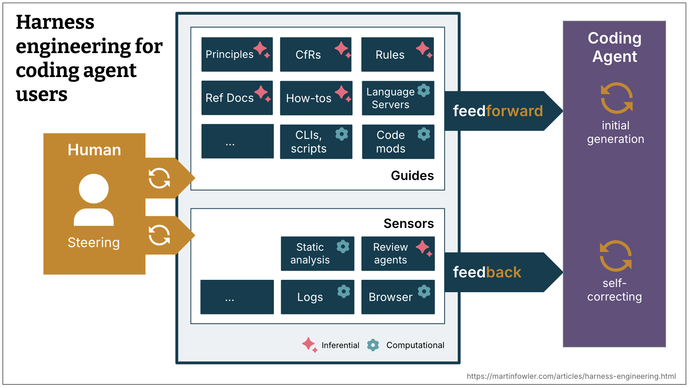

# 面向编码智能体用户的 Harness 工程

本文由 Martin Fowler 团队的 Birgitta Böckeler 撰写，提供了一个在编码智能体语境下构建信任的思维模型——通过前馈指南、反馈传感器和迭代式 Harness 工程。

## 核心定义

**Harness** 这个术语已经成为 AI 智能体中除模型本身外一切的简写——[智能体 = 模型 + Harness](https://blog.langchain.com/the-anatomy-of-an-agent-harness/)。这是一个非常宽泛的定义，因此值得为常见的智能体类别缩小范围。

在**编码智能体**的语境下，Harness 的一部分已经内置（例如通过系统提示词、选择的代码检索机制，甚至是[复杂的编排系统](https://www.anthropic.com/engineering/effective-harnesses-for-long-running-agents)）。但编码智能体也为用户提供了许多功能来构建专门针对用例和系统的**外层 Harness**。

**图 1**："Harness" 一词的含义取决于边界上下文。三个同心圆：模型在核心（最终被 harness 的事物），然后是编码智能体的构建者 harness，再外面是编码智能体的用户 harness。

---

## Harness 的双重目标

一个构建良好的外层 Harness 服务于两个目标：

1. **提高智能体第一次就做对的概率**
2. **提供一个反馈循环，在问题到达人眼之前自我纠正尽可能多的问题**

最终，它应该减少审查工作并提高系统质量，同时还能减少浪费的 token。

---

## 计算型 vs 推理型

指南和传感器有两种执行类型：

| 类型 | 描述 | 示例 | 速度 | 可靠性 |
|------|------|------|------|--------|
| **计算型（Computational）** | 确定性且快速，由 CPU 运行 | 测试、lint、类型检查器、结构分析 | 毫秒到秒 | 可靠 |
| **推理型（Inferential）** | 语义分析、AI 代码审查、"LLM 作为法官" | 语义分析、AI 代码审查 | 更慢更昂贵 | 更不确定 |

**计算型指南**通过确定性工具提高良好结果的概率。**计算型传感器**足够便宜和快速，可以在每次更改时与智能体一起运行。**推理型控制**当然更昂贵且更不确定，但允许我们既提供丰富的指导，又添加额外的语义判断。尽管具有不确定性，当使用强大的模型或适合手头任务的模型时，推理型传感器尤其可以增加我们的信任。

---

## 引导循环

人类在这其中的工作是通过迭代 Harness 来**引导**智能体。每当问题多次发生时，应该改进前馈和反馈控制，以使问题将来发生的可能性降低，甚至完全防止它。

在引导循环中，当然也可以使用 AI 来改进 Harness。编码智能体现在使构建更多自定义控制和更多自定义静态分析变得便宜得多。智能体可以帮助编写结构测试、从观察到的模式生成规则草案、搭建自定义 linter，或从代码库考古中创建操作指南。

---

## 时机：保持质量向左

持续集成的团队一直面临着根据成本、速度和关键程度在开发时间线上分布测试、检查和人工审查的挑战。当渴望持续交付时，理想情况下甚至希望每个提交状态都可部署。你希望检查尽可能靠近生产路径的左侧，因为越早发现问题，修复成本就越低。反馈传感器，包括新的推理型传感器，需要相应地分布在整个生命周期中。

**变更生命周期中的前馈和反馈**：
- 什么是足够快的，甚至应该在集成之前运行，甚至在创建提交之前？（例如 linter、快速测试套件、基本代码审查智能体）
- 什么更昂贵，因此只应在集成后在管道中运行，除了重复快速控制之外？（例如突变测试、可以考虑更大图景的更广泛代码审查）

**持续漂移和健康传感器**：
- 什么类型的漂移会逐渐累积，应该通过在变更生命周期之外持续运行的传感器来监控？（例如死代码检测、测试覆盖质量分析、依赖扫描器）
- 智能体可以监控什么运行时反馈？（例如让它们查找恶化的 SLO 以提出改进建议，或 AI 法官持续采样响应质量并标记日志异常）

---

## 监管类别

智能体 Harness 就像一个[控制论](https://en.wikipedia.org/wiki/Cybernetics)调速器，结合前馈和反馈来调节代码库朝其期望状态发展。区分期望状态的多个维度是有用的，按 Harness 应该监管的内容分类。区分这些类别有帮助，因为 Harness 能力和复杂性在它们之间变化，限定这个词为我们提供了更精确的语言，否则这个术语会非常通用。

### 可维护性 Harness（Maintainability harness）

本文中给出的几乎所有示例都是关于监管内部代码质量和可维护性的。这目前是最容易的 Harness 类型，因为我们有很多可以用于此的预先存在的工具。

**计算型传感器**可靠地捕获结构性内容：重复代码、循环复杂度、缺失的测试覆盖、架构漂移、风格违规。这些便宜、经过验证且确定。

**LLM 可以部分解决需要语义判断的问题**——语义重复代码、冗余测试、暴力修复、过度工程化的解决方案——但昂贵且概率性。不是在每个提交上。

**两者都不能可靠地捕获一些更高影响的问题**：问题的误诊、过度工程化和不必要的功能、误解的指令。它们有时会捕获，但不够可靠以减少监督。如果人类首先没有清楚地指定他们想要什么，正确性就不在任何传感器的范围内。

### 架构适用性 Harness（Architecture fitness harness）

这组指南和传感器定义和检查应用程序的架构特征。基本上：[适用性函数](https://www.thoughtworks.com/en-de/radar/techniques/architectural-fitness-function)。

**示例**：
- 前馈我们性能要求的技能，以及反馈给智能体它是改进还是降低了性能的性能测试
- 描述更好可观测性编码约定的技能（如日志标准），以及要求智能体反思它可用的日志质量的调试指令

### 行为 Harness（Behaviour harness）

这是房间里的大象——我们如何引导和感知应用程序是否按照我们需要的方式功能运行？目前，看到大多数给编码智能体高度自主权的人都这样做：

- **前馈**：功能规范（详细程度不一，从简短提示到多文件描述）
- **反馈**：检查 AI 生成的测试套件是否通过，具有合理的高覆盖，有些人甚至可能用突变测试监控其质量。然后将其与手动测试结合。

这种方法对 AI 生成的测试寄予了很大信任，这还不够好。一些同事在[批准夹具](https://lexler.github.io/augmented-coding-patterns/patterns/approved-fixtures/)模式上看到了良好结果，但它在某些领域比其他领域更容易应用。他们有选择地在适合的地方使用它，这不是测试质量问题的全面答案。

因此总的来说，我们仍有很多工作要做，以找出功能行为的良好 Harness，增加我们的信心足以减少监督和手动测试。

---

## Harness 能力

并非每个代码库都同样适合 Harnessing。用强类型语言编写的代码库自然有类型检查作为传感器；可明确定义的模块边界提供架构约束规则；像 Spring 这样的框架抽象掉了智能体甚至不必担心的细节，因此隐式地提高了智能体成功的机会。没有这些属性，这些控制就无法构建。

这在绿地与遗留项目中表现不同。绿地团队可以从第一天就内置 Harness 能力——技术决策和架构选择决定了代码库的可治理程度。遗留团队，尤其是那些积累了大量技术债务的应用程序，面临更难的问题：Harness 最需要的地方也是最难构建的地方。

---

## Harness 模板

大多数企业都有一些常见的服务拓扑，覆盖了他们需要的 80%——通过 API 暴露数据的业务服务；事件处理服务；数据仪表板。在许多成熟的工程组织中，这些拓扑已经在服务模板中编码。这些将来可能会演变成 Harness 模板：一组指南和传感器的捆绑包，将编码智能体拴在拓扑的结构、约定和技术栈上。团队可能会部分基于已经有哪些可用的 Harness 来选择技术栈和结构。

我们当然会面临与服务模板类似的挑战。一旦团队实例化它们，它们就开始与上游改进不同步。Harness 模板将面临相同的版本控制和贡献问题，对于非确定性且更难测试的指南和传感器可能甚至更糟。

---

## 人类的角色

作为人类开发者，我们将我们的技能和经验作为隐式 Harness 带到每个代码库。我们吸收了约定和良好实践，我们感受到了复杂性的认知痛苦，我们知道我们的名字在提交上。我们还携带着组织一致性——意识到团队正在努力实现什么，哪些技术债务因业务原因被容忍，以及在这个特定上下文中"好"是什么样子。我们以小步骤和我们人类的速度前进，这为该经验被触发和应用创造了思考空间。

编码智能体没有这一切：没有社会责任感，对 300 行函数没有美学厌恶，没有"我们这里不那样做"的直觉，也没有组织记忆。它不知道哪个约定是承载负载的，哪个只是习惯，或者技术上正确的解决方案是否适合团队正在努力做的事情。

Harness 是尝试外化并明确人类开发者经验带来的东西，但它只能走这么远。构建一个连贯的指南和传感器系统以及自我纠正循环是昂贵的，因此我们必须以明确的目标优先考虑：一个好的 Harness 不一定旨在完全消除人类输入，而是将其引导到我们的输入最重要的地方。

---

## 起点——和开放问题

这里阐述的思维模型描述了已经在实践中发生的技术，并帮助框架讨论我们仍需要弄清楚的内容。其目标是将对话提升到功能级别之上——从技能和 MCP 服务器到我们如何战略性地设计一个控制系统，让我们对智能体产生的内容真正有信心。

以下是当前话语中与 Harness 相关的一些示例：
- [OpenAI 团队记录了他们的 Harness 是什么样子](https://openai.com/index/harness-engineering/)：由自定义 linter 和结构测试强制执行的分层架构，以及定期的"垃圾收集"来扫描漂移并让智能体建议修复。他们的结论："我们最困难的挑战现在集中在设计环境、反馈循环和控制系统上。"
- [Stripe 关于他们的 minions 的文章](https://stripe.dev/blog/minions-stripes-one-shot-end-to-end-coding-agents)描述了诸如基于启发式运行相关 linter 的预推送钩子之类的事情，他们强调了"向左反馈"对他们有多重要，他们的"蓝图"展示了他们如何将反馈传感器集成到智能体工作流中。
- 突变和结构测试是计算型反馈传感器的示例，它们在过去未被充分利用，但现在正在复兴。
- 开发者之间关于在编码智能体中集成 LSP 和代码智能的讨论越来越多，这是计算型前馈指南的示例。
- 听到 Thoughtworks 团队关于使用计算型和推理型传感器解决架构漂移的故事，例如通过智能体和自定义 linter 的混合提高 API 质量，或通过"清洁大军"提高代码质量。

还有很多需要弄清楚的，不仅仅是已经提到的行为 Harness。我们如何保持 Harness 连贯随着它的增长，指南和传感器同步，不相互矛盾？当指令和反馈信号指向不同方向时，我们能在多大程度上信任智能体做出明智的权衡？如果传感器从不触发，这是高质量的标志还是检测机制不足？我们需要一种类似于测试的代码覆盖和突变测试的方法来评估 Harness 覆盖和质量。前馈和反馈控制目前分散在交付步骤中，工具有真正的潜力来帮助配置、同步和推理它们作为一个系统。构建这个外层 Harness 正在成为一个持续的工程实践，而不是一次性配置。

---

## 相关研究

- [[Harness-Engineering|Harness 工程]]
- [[Mitchellh-AI-Adoption-Journey|Mitchell Hashimoto 的 AI 采用之旅]]
- [[OpenAI-Codex-Harness-Engineering|OpenAI Codex Harness 工程]]
