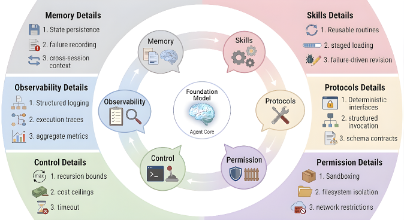
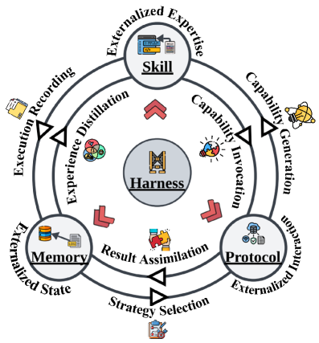

# Harness 工程

**Harness 工程**是构建外部化 Agent 运行时环境的综合学科。它将记忆、技能和协议这三个外部化模块统一成一个连贯的认知环境。

## 什么是 Harness？

Harness 是将原始模型能力转化为可靠 Agent 行为的脚手架。实用的 Agent 最好被理解为在 Harness 内部运行的模型，而不是带有外围能力的模型。

> **核心洞见**：Harness 不仅仅是实现便利性，它是设计的认知环境，外部化模块在其中共同生效。

### Harness 的功能组成

Harness 包含使这种耦合成为可能的外部系统：
- 持久记忆和项目级上下文
- 可重用技能和可执行例程
- 用于与工具和服务进行确定性交互的协议化接口
- 更广泛的运行时基础设施

## Harness 的六大分析维度

### 1. 智能体循环和控制流

智能体循环是 Harness 的时间骨干。最简单的形式是实现感知-检索-计划-行动-观察周期。

**关键控制机制**：
- 最大步数限制
- 递归深度边界
- 每步成本上限
- 超时约束

这些控制定义了模型推理展开的操作 envelope。

### 2. 沙箱和执行隔离

每当 Agent 对世界采取行动时，Harness 必须决定暴露多少环境以及如何包含意外的副作用。

**隔离粒度**：
- **云沙箱** - 每个任务在专用云沙箱中运行，带有自己的文件系统快照、网络限制和资源配额
- **分级权限模式** - 暴露从完全自主执行到每个工具调用都需要强制用户批准的分级权限模式

**沙箱的双重作用**：
1. 安全围栏 - 限制危险操作
2. 认知边界 - 通过移除不相关状态简化 Agent 的操作环境

### 3. 人工监督和审批门

完全自主很少适合部署的 Agent。大多数生产系统在 Agent 循环中插入干预点。

**常见模式**：
- **执行前批准** - 在每个可能有后果的行动之前暂停 Agent 并请求明确确认
- **执行后审查** - 让 Agent 行动但在提交或继续之前将结果浮出水面进行检查
- **升级触发器** - 允许 Agent 在正常条件下自主运行，但在检测到特定风险信号时暂停并请求人工输入
- **Hook 系统** - 允许操作员将任意逻辑附加到 Agent 循环中的特定生命周期事件

### 4. 可观测性和结构化反馈

不留下可检查轨迹的 Agent 是无法调试、审计或改进的 Agent。

**可观测性的实现**：
- 每个模型调用、工具调用、内存读/写和决策分支的结构化日志
- 将每个行动与其因果前因联系起来的执行轨迹
- 聚合指标，如步数、令牌消耗、错误率和延迟分布

**双重目的**：
1. **外部** - 支持调试、合规审计和事件后分析
2. **内部** - 关闭将执行结果连接回产生它们的模块的反馈循环

### 5. 配置、权限和策略编码

Harness 必须不仅编码 Agent 可以做什么，还要编码它在什么条件下被允许做什么。

**分层配置**：
- **用户级设置** - 编码个人偏好和信任边界
- **项目级设置** - 指定哪些工具可用、哪些文件路径可访问以及哪些命令需要批准
- **组织级设置** - 施加合规约束、成本上限和单个项目无法覆盖的数据处理规则

### 6. 上下文预算管理

上下文窗口仍然是任何 Agent 系统中最稀缺的共享资源。

**有效管理策略**：
- **摘要** - 将较旧的对话轮次和执行历史压缩为更短的表示
- **基于优先级的驱逐** - 移除或降级与活动子任务相关性已衰减的上下文条目
- **分阶段加载** - 确保详细的程序指导仅在检测到匹配的任务模式时才进入上下文

## 生产系统中的 Harness

成熟的 Agent 系统在以下方面收敛于惊人相似的 Harness 结构集：

| 维度 | 共同模式 |
|------|----------|
| **循环和控制流** | 围绕显式循环组织执行，带有终止控制 |
| **沙箱** | 在不同粒度实现执行隔离 |
| **人工监督** | 实现可配置的审批门和 hook 系统 |
| **可观测性** | 产生结构化执行轨迹和日志 |
| **配置和治理** | 跨多个范围分层配置 |
| **上下文预算** | 通过摘要、分阶段加载和驱逐主动管理 |

## Harness 作为认知环境

Harness 的重要性超出了普通软件工程意义上的基础设施。它通过确定推理展开的环境来塑造 Agent 的有效认知。

> **关键主张**：Agent 可以知道、记住和做什么，不仅由模型权重固定，还由周围系统提供的访问、持久性和行动条件固定。

### 理论视角

1. **Norman 的认知人工制品** - Harness 在系统级别符合此描述。它不仅仅是用更多上下文或更多工具增强模型；它重组了模型面临的表征问题。

2. **Kirsh 的空间智能使用** - Harness 为 Agent 发挥类似作用。它是一个认知生态位，其中信息、工具、权限和程序被安排成使得期望行为更容易执行而不期望行为更难产生。

3. **分布式认知** - 操作智能分布在模型参数、外部记忆存储、可执行技能、协议定义、工具表面、监控系统和管理它们交互的运行时约束之间。

## 模块交互图

记忆、技能和协议在 Harness 内部通过六个主要流动相互强化：

1. **记忆到技能** - 经验蒸馏
2. **技能到记忆** - 执行记录
3. **技能到协议** - 能力调用
4. **协议到技能** - 能力生成
5. **记忆到协议** - 策略选择
6. **协议到记忆** - 结果同化

## 相关研究

- [[Externalization-in-LLM-Agents|LLM Agent 中的外部化]]
- [[Memory-Systems|记忆系统]]
- [[Skill-Systems|技能系统]]
- [[Agent-Protocols|智能体协议]]
