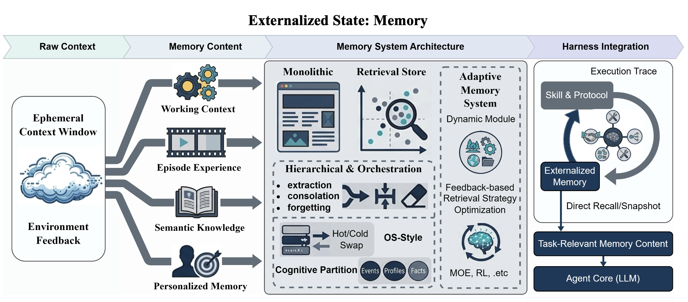

# 记忆系统

**记忆外部化**解决了智能体的时间负担问题。它将 Agent 的状态跨时间与短暂上下文解耦，使得连续性不再依赖于短暂的提示。

## 记忆的四大维度

### 1. 工作上下文

工作上下文是当前任务的实时中间状态：打开的文件、临时变量、活跃假设、部分计划和执行检查点。

- **快速变化**，如果过时就失去价值
- **没有外部化**，一旦上下文窗口重置或进程被中断就会消失
- **示例**：编码 Agent 中的草稿、终端状态和工作区工件

### 2. 情景经验

情景经验记录先前运行中发生的事情：决策点、工具调用、失败、结果和反思。

- **价值不仅是档案性的** - 检索的情节可以作为具体先例
- **帮助 Agent 避免重复已知错误**
- **为以后的抽象提供原材料**
- **示例**：Reflexion 将失败尝试的反思摘要存储为可重用经验

### 3. 语义知识

语义知识存储在任何单个情节之外都存在的抽象：领域事实、一般启发式、项目约定和稳定的世界知识。

- **不是围绕特定时间和地点组织的**
- **情景记忆说案例中发生了什么；语义记忆说什么倾向于在案例中成立**
- **示例**：知识库和检索增强生成 (RAG) 语料库

### 4. 个性化记忆

个性化记忆跟踪关于特定用户、团队或环境的稳定信息：偏好、习惯、重复出现的约束和先前的交互。

- **不应折叠到 Agent 的一般自我改进存储中**
- **用户特定的轨迹遵循不同的保留、检索和隐私规则**
- **示例**：IFRAgent 从移动环境中的演示构建用户习惯存储库

## 记忆架构的演进

记忆架构可以被理解为四种广泛的范式：

### 1. 单片上下文

早期系统依赖单片上下文：所有相关历史或其摘要都直接保留在提示中。

- **优点**：透明且易于原型设计
- **限制**：容量扩展性差，摘要漂移，状态随会话消失

### 2. 带有检索存储的上下文

占主导地位的下一步是仅将近期工作状态保留在上下文中，同时将长期轨迹存储在外部并按需检索。

- **解决原始容量问题**
- **但将记忆质量转化为检索问题**
- **改进方向**：GraphRAG 添加图结构、ENGRAM 压缩为潜在状态表示、SYNAPSE 在统一情景-语义图上使用扩散激活

### 3. 分层记忆和编排

一旦平面检索证明不足，系统就会转向分层记忆和编排。关键思想是，并非每个轨迹都应获得相同的保留策略或检索路径。

**两种主要设计趋势**：
1. **时空维度中的资源解耦** - 借用操作系统逻辑，将热工作状态与较冷的长尾存储分离，并在任务需求变化时跨层交换信息
2. **认知功能维度中的语义解耦** - 按功能或内容类型组织记忆，以便异构记录不会都通过同一通道路由

### 4. 自适应记忆系统

上述架构仍然严重依赖人工设计的启发式。自适应记忆系统更进一步，使模块、路由决策或检索策略对经验做出响应。

**两个方向**：
1. **动态模块** - 一些系统在运行时调整架构本身
2. **基于反馈的策略优化** - 其他系统保持架构相对固定但学习更好的控制策略

## Harness 时代的记忆需求

随着 Agent 演变为 Harness 时代，记忆系统不再仅仅是孤立的存储模块；相反，它们成为运行时协调连续性、程序重用和治理交互的基板。

**关键要求**：
1. **状态与上下文的显式分离** - 不受限制的会话历史累积会导致模型失去跟踪
2. **与技能系统集成** - 记忆存储先前执行的证据；技能仅在某些证据被提升为显式可重用程序时才开始
3. **协议耦合** - 工具结果、批准、委托事件和外部状态转换通过协议化接口到达，但只有在被规范化并写入持久状态后才会成为记忆
4. **共享和治理机制** - 一旦多个 Agent 依赖公共外部化状态，建立读写权限、解决冲突和控制访问配额就变得必要

## 记忆作为认知人工制品

现代 LLM 是无状态生成器：每次调用都以新的上下文开始，因此必须重建连续性而不是向前携带。

**记忆外部化改变了该任务的结构**：
- 从**内部回忆问题**转变为**外部识别和检索问题**
- 模型不再必须从其参数中恢复相关历史；它必须识别并使用记忆系统已经浮出水面的历史切片

**这解释了为什么检索质量比原始存储容量更重要**：
- 拥有庞大存储但检索薄弱的系统仍然向模型呈现错误的问题表示
- 具有强大索引、摘要和上下文选择的适度存储可以使下游推理显著更容易

**成功标准**：不是"我们保存了多少？"，而是"我们是否使当前决策清晰可辨？"

## 相关研究

- [[Externalization-in-LLM-Agents|LLM Agent 中的外部化]]
- [[Harness-Engineering|Harness 工程]]
- [[Skill-Systems|技能系统]]
