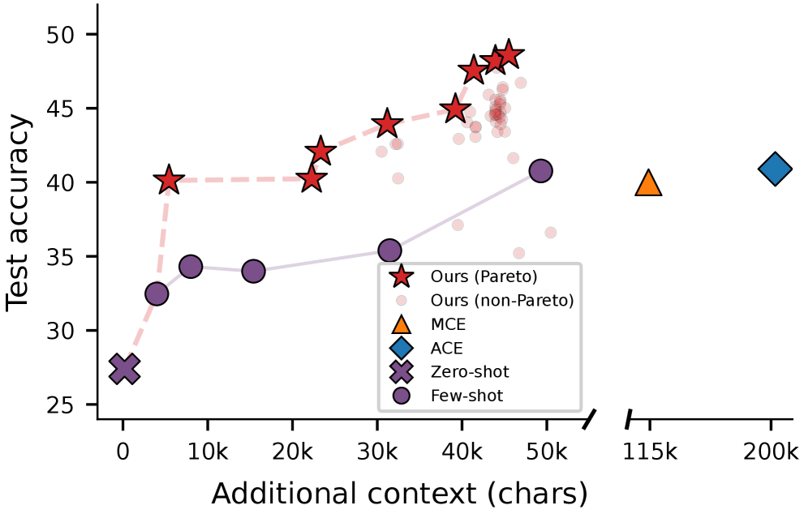

# Meta-Harness：模型 Harness 的端到端优化

Meta-Harness 是斯坦福大学和 MIT 联合提出的一个外环系统，用于搜索 LLM 应用的 Harness 代码。它使用一个智能体提议者，通过文件系统访问所有先前候选的源代码、分数和执行轨迹。

> **核心洞察**：改变固定 LLM 周围的 Harness 可以在同一基准上产生 **6 倍的性能差距**。Harness——决定存储、检索和向模型显示什么的代码——通常与模型本身一样重要。


**图 1**：（左）在文本分类上，Meta-Harness 优于最佳的先前人工设计的 Harness（ACE）和现有的文本优化器（TTT-Discover、OpenEvolve），仅在 4 次评估后就匹配了次优方法的最终准确度。（右）在 TerminalBench-2 上，Meta-Harness 优于所有报告的 Claude Haiku 4.5 harness。

---

## 问题与动机

### Harness 工程的现状

Harness 工程是改进 LLM 周围代码以提高整体系统性能的实践。然而，尽管其重要性，Harness 工程仍然主要是人工的：从业者检查失败、调整启发式，并在少量设计上迭代。

### 现有文本优化方法的局限性

文本优化是一个自然的起点，但这些方法与 Harness 工程不匹配，因为它们通常在短期或严重压缩的反馈下操作：

- 一些方法仅以当前候选为条件
- 其他方法主要依赖标量分数
- 还有一些方法将反馈限制为短模板或 LLM 生成的摘要

这是一个实用的可扩展性选择，而不是长期依赖没有信息的证据。Harness 在长期范围内运作：关于存储什么、何时检索它或如何呈现它的单个选择可能在许多推理步骤后影响行为。

### 反馈规模对比

| 方法 | 历史 | 日志内容 | MTok/iter |
|------|------|----------|-----------|
| OPRO | 窗口 | 过去的（解决方案，分数）对 | 0.002 |
| TextGrad | 最后 | 当前工件的文本反馈 | 0.015 |
| AlphaEvolve | 窗口 | 程序数据库 + 评估分数 | 0.022 |
| GEPA | 摘要 | 来自回滚轨迹的反思反馈 | 0.008 |
| Feedback Descent | 摘要 | 比较 + 文本反馈 | 0.012 |
| TTT-Discover | 窗口 | 先前的解决方案片段 | 0.026 |
| **Meta-Harness** | **完整** | **所有日志和分数** | **10.0** |

在本文研究的设置中，单个评估可以产生多达 **10,000,000 个 token 的诊断信息**，大约比先前文本优化设置中使用的最大反馈预算高出三个数量级。


**图 2**：Meta-Harness 搜索循环。（1）智能体读取包含所有先前候选的源代码、执行轨迹和分数的文件系统，并提出新的 Harness。（2）我们在评估任务上评估提议的 Harness。（3）所有日志（提议的代码、推理轨迹、评估分数）都存储在文件系统的新目录中，循环重复。

---

## Meta-Harness 设计

Meta-Harness 是一个用于通过端到端搜索优化 Harness 的智能体 Harness。

### 目标形式化

Harness 是一个有状态的程序，它包装语言模型并确定模型在每一步看到什么上下文。目标很简单：找到使底层模型在目标任务分布上表现最佳的 Harness。

形式化地说，令 $M$ 表示固定语言模型，$\mathcal{X}$ 表示任务分布。对于 Harness $H$ 和任务实例 $x\sim\mathcal{X}$，我们执行回滚轨迹 $\tau\sim p_{M}(H,x)$。Harness 为 $M$ 构建提示，模型响应，Harness 在每次交互后更新其状态。特定任务的奖励函数 $r(\tau,x)$ 对轨迹进行评分。Harness 优化的目标是找到最大化期望最终奖励的 Harness：

$$
H^{*}=\operatorname*{arg\,max}_{H}\mathbb{E}_{x\sim\mathcal{X},\tau\sim p_{M}(H,x)}\;r(\tau,x),
$$

### 关键设计选择

1. **通过文件系统暴露完整历史** - 使能选择性诊断原始先前代码和执行轨迹，而不是从压缩的每候选摘要优化
2. **智能体提议者** - 编码智能体决定检查什么并通过与代码库的直接交互验证编辑
3. **无父代选择规则** - 提议者可以自由检查任何先前的 Harness 及其执行轨迹

### 文件系统存储

对于每个先前的候选 Harness，文件系统存储：
- **源代码**
- **评估分数**
- **执行轨迹**（提示、工具调用、模型输出、状态更新）

文件系统通常远大于提议者的上下文窗口，因此提议者通过终端工具（如 grep 和 cat）查询它，而不是将其作为单个提示摄入。

### Meta-Harness 搜索循环

1. **智能体读取文件系统** - 包含所有先前候选的源代码、执行轨迹和分数
2. **提议新 Harness** - 基于检查的历史提出改进
3. **评估候选** - 在评估任务上测试提议的 Harness
4. **存储日志** - 将所有日志（提议的代码、推理轨迹、评估分数）存储在文件系统中
5. **重复循环**

### 算法伪代码

```
算法 1 Meta-Harness 外环 Harness 优化

输入: 任务 X, LLM M, 提议者 P, 迭代次数 N

初始化: 种群 H  ▶ 初始有效 Harness 集合
初始化: 文件系统 D ← ∅  ▶ 存储代码、分数、轨迹

for H ∈ H do
   E_H ← Evaluate(H, M, X)
   D ← D ∪ {(H, E_H)}

for t = 1 ... N do
   提议者 P 查询文件系统 D  ▶ 检查先前的 Harness 和分数
   提议者 P 提出 k 个新 Harness {H_1,…,H_k}
   for H ∈ {H_1,…,H_k} do
      if H 通过接口验证 then
         D ← D ∪ {(H, Evaluate(H, M, X))}

返回存储在 D 中的 Harness 的 Pareto 前沿
```

---

## 代码空间搜索的优势

Harness 优化发生在代码空间中，对检索、记忆或提示构建逻辑的小更改可能在许多步骤后影响行为，使得局部搜索启发式与此问题不匹配。

### 因果推理能力

通过检查执行轨迹，提议者通常可以推断**为什么**一个 Harness 失败以及哪些早期设计选择可能导致了失败，而不仅仅是**它**失败了。

提议者可以在算法结构级别修改 Harness，范围从对检索、记忆或提示构建逻辑的更改到完整程序重写，而不是填写模板或应用预定义的变异算子。

### 实际实现细节

在实验中，每个 Harness 是一个单文件 Python 程序，修改特定任务的提示、检索、记忆和编排逻辑。

- **提议者 P**：带有 Opus-4.6 的 Claude Code
- **指导**：最小的特定领域技能，描述在哪里编写新 Harness、如何检查先前的 Harness 及其执行轨迹，以及它可以和不能修改哪些文件
- **基础模型 M**：因领域而异，始终冻结
- **典型运行**：在 20 次迭代中评估约 60 个 Harness

---

## 实验结果

### 4.1 在线文本分类

遵循在线文本分类设置：LLM 一次接收一个标记示例，更新其记忆，并在预留测试集上评估。使用 GPT-OSS-120B 作为 LLM 文本分类器。

**三个数据集**：
1. **LawBench (Law)** - 从案例描述预测刑事指控（215 个类别）
2. **Symptom2Disease (S2D)** - 从症状描述预测疾病（22 个类别）
3. **USPTO-50k** - 从产物分子预测前体反应物（180 个类别）

**搜索设置**：
- 从主要基线 Harness 初始化搜索种群：zero-shot、few-shot、ACE 和 MCE
- 运行 20 次进化迭代，每次迭代两个候选，产生 40 个候选 Harness



**表 2**：所有 Harness 在三个数据集上的测试集指标。Ctx 表示上下文中的额外输入 token（千）。†：来自 51 的实现。↓：越低越好。Meta-Harness 在使用更小输入上下文的同时提高了在线文本分类准确度。

**结果**：
- Meta-Harness 在 ACE（Agentic Context Engineering）的基础上提高了 **7.7 分**，同时使用的上下文 token 减少了 **4 倍**
- 仅用 **4 次评估**就匹配了次优文本优化器的最终性能
- 其最终准确度比所有基线高出 **10 分以上**

**消融研究**：

| 方法 | 分数 | 代码 | 摘要 | 轨迹 | 中位数 ↑ | 最佳准确度 ↑ | > ZS |
|------|------|------|------|------|---------|-------------|------|
| 仅分数 | ✓ | ✓ | × | × | 34.6 | 41.3 | 26 |
| 分数 + 摘要 | ✓ | ✓ | ✓ | × | 34.9 | 38.7 | 23 |
| Meta-Harness (完整) | ✓ | ✓ | - | ✓ | 50.0 | 56.7 | 39 |

**关键发现**：完整访问执行轨迹是使能 Harness 搜索的关键成分。摘要不能恢复丢失的信号，甚至可能通过压缩掉诊断有用的细节而造成伤害。

---

### 4.2 检索增强推理的 Harness

研究一个有点非标准的奥林匹克数学解决设置：用从大型语料库检索示例的能力增强模型。

**检索语料库**：
- ≥ 500,000 个已解决问题，来自八个开源数据集
- 仔细去重和去污染
- 手动检查预留示例的顶级 BM25 检索

**搜索设置**：
- 使用 Meta-Harness 在 250 道奥林匹克难度数学问题的搜索集上优化 40 次迭代
- 产生 109 个候选检索 Harness
- 从零样本、少样本和 ACE 初始化搜索种群
- 基于搜索集性能使用 GPT-OSS-20B 选择单个 Harness

**评估设置**：
- 在 200 道以前未见的 IMO 级问题上评估（IMO-AnswerBench、IMO-ProofBench、ArXivMath）
- 除了 GPT-OSS-20B 外，还在搜索期间未见的四个模型上评估相同的检索 Harness：GPT-5.4-nano、GPT-5.4-mini、Gemini-3.1-Flash-Lite、Gemini-3-Flash

**结果**：

| 方法 | GPT-5.4n | GPT-5.4m | Gem-3.1FL | Gem-3F | GPT-20B | 平均 |
|------|-----------|-----------|------------|---------|----------|------|
| 无检索器 | 23.0 | 28.8 | 28.6 | 42.6 | 47.6 | 34.1 |
| 密集检索 (k=1) | 27.1 (+4.1) | 24.5 (-4.3) | 31.3 (+2.7) | 42.3 (-0.3) | 46.9 (-0.7) | 34.4 (+0.3) |
| 密集检索 (k=5) | 31.1 (+8.1) | 28.3 (-0.5) | 37.1 (+8.5) | 47.2 (+4.6) | 46.7 (-0.9) | 38.1 (+4.0) |
| 随机少样本 | 23.1 (+0.1) | 24.5 (-4.3) | 31.0 (+2.4) | 40.4 (-2.2) | 41.8 (-5.8) | 32.2 (-1.9) |
| BM25 检索 | 30.2 (+7.2) | 29.2 (+0.4) | 32.8 (+4.2) | 46.6 (+4.0) | 48.9 (+1.3) | 37.5 (+3.4) |
| Meta-Harness | 31.7 (+8.7) | 30.4 (+1.6) | 34.9 (+6.3) | 46.3 (+3.7) | 50.6 (+3.0) | 38.8 (+4.7) |

**关键发现**：发现的检索 Harness 在所有五个预留模型上都优于无检索基线，平均增益为 **4.7 分**。它还匹配或超过了最强的固定基线，总体上比 BM25 检索高出 1.3 分，同时避免了在几个模型上观察到的密集检索和随机少样本提示的回归。

---

### 4.3 在 TerminalBench-2 上评估智能体编码 Harness

TerminalBench-2 在 89 个具有挑战性的任务上评估 LLM 智能体，这些任务需要在复杂依赖下的长期、完全自主执行，以及大量领域知识。

**搜索设置**：
- 从两个强大的开放基线初始化搜索：Terminus 2 和 Terminus-KIRA
- 在相同的 89 任务基准上执行搜索和最终评估
- 将此基准用作发现问题
- 通过手动检查和基于正则表达式的审计检查过拟合，以查找任务特定字符串泄漏到进化的 Harness 中

**结果**：

| Harness | 自动 | 通过率 (%) |
|---------|------|-----------|
| **Claude Opus 4.6** | | |
| Claude Code | × | 58.0 |
| Terminus 2 | × | 62.9 |
| Mux | × | 66.5 |
| Droid | × | 69.9 |
| TongAgents | × | 71.9 |
| MAYA-V2 | × | 72.1 |
| Terminus-KIRA | × | 74.7 |
| Capy | × | 75.3 |
| ForgeCode | × | 81.8 |
| Meta-Harness | ✓ | **76.4** |
| **Claude Haiku 4.5** | | |
| OpenHands | × | 13.9 |
| Claude Code | × | 27.5 |
| Terminus 2 | × | 28.3 |
| Mini-SWE-Agent | × | 29.8 |
| Terminus-KIRA | × | 33.7 |
| Goose | × | 35.5 |
| Meta-Harness | ✓ | **37.6** |

**关键发现**：
- 在 Opus 4.6 上，Meta-Harness 发现的 Harness 达到 **76.4%** 通过率，超过了人工设计的 Terminus-KIRA（74.7%），在 TerminalBench-2 排行榜上所有 Opus 4.6 智能体中排名 **#2**
- 在较弱的 Haiku 4.5 模型上，改进更大：Meta-Harness 达到 **37.6%**，比次优报告的智能体（Goose，35.5%）高出 **2.1 分**

---

## 提议者的定性行为

### A.1 文件访问统计

为验证提议者实质性地使用文件系统而不是默认局部编辑，记录了每次迭代的所有文件读取。

**结果摘要**：
- 提议者每次迭代读取**中位数 82 个文件**（范围 69–99）
- 大致均匀地分配在先前 Harness 源代码（41%）和执行轨迹（40%）之间
- 其余部分用于分数摘要（6%）和其他文件（13%）

这证实了提议者的访问模式是非马尔可夫的：它例行检查大多数可用历史，而不是仅以最近的父代为条件。

### A.2 定性行为：对先前失败的因果推理

TerminalBench-2 搜索日志揭示了一个清晰的叙事弧线，其中提议者从自己的回归中学习。它不是通过局部编辑随机漫步，而是形成对早期候选为什么失败的明确诊断，然后转向更安全的设计模式。

#### 迭代 1–2：有希望的 bug 修复与提示编辑混淆

前两次迭代都将看似合理的结构修复与提示模板修改捆绑在一起，并且都从 64.4% 的 Terminus-KIRA 基线急剧回归。

#### 迭代 3：提议者识别混淆

到迭代 3，提议者明确推断回归主要不是由于结构 bug 修复本身：

> **假设**：__CMDEND__ 标记片段在长期任务上泄漏到 LLM 观察中，导致模型混淆并进入无限无工具调用循环。剥离这些标记 + 添加循环断路器将恢复浪费的步骤。

提议者注意到前两次失败的共同因素不是特定的 bug 修复，而是繁重的清理提示重写。因此，它恢复到原始提示并仅测试标记剥离和循环断路器。

#### 迭代 4–6：对诊断失败模式的直接修复仍然回归

接下来的三次迭代继续探测设计空间的相同部分，但现在有了关于为什么完成逻辑脆弱的更明确理论。

#### 迭代 7：获胜候选

在六次连续回归后，提议者从修改控制循环转向在循环开始前添加信息：

> **策略转变**：所有 6 次先前迭代都从 64.4% 基线回归，因为它们修改了完成流程、提示模板或观察处理。evo_env_bootstrap 采取不同的方法——纯粹是加法的。它在第一次 LLM 调用之前通过单个 shell 命令收集环境快照，并将其附加到初始提示。不更改其他方法。这应该在依赖繁重的任务上消除 3–5 次浪费的探索回合，而不会冒着在已经通过的任务上回归的风险。

这个候选是迄今为止最好的结果。重要的一点不仅是迭代 7 获胜，而且提议者阐明了**为什么**它应该更安全：它避免触摸先前脆弱的完成机制，而是添加主要在困难任务上有用的信息。

---

## 讨论

除了优于现有 Harness 外，Meta-Harness 还有几个实际优势：

1. **泛化能力**：发现的 Harness 泛化到分布外分类数据集和数学设置中未见的基础模型
2. **时间效率**：一次搜索运行在几小时的挂钟时间内完成，但产生可读、可转移的策略，可以跨模型重用，包括未来更强的模型
3. **可检查性**：代码空间中的过拟合也更可检查：脆弱的 if 链或硬编码的类映射在检查中可见，而权重空间过拟合则不是

更广泛地说，我们的结果表明 Meta-Harness 的主要优势不仅是代码搜索，而且是**对先前诊断经验的选择性访问**搜索。提议者不限于标量奖励或固定摘要；它可以检查原始代码、执行轨迹和先前失败，然后使用该信息形成和测试关于更改什么的假设。

---

## 相关研究

- [[Harness-Engineering|Harness 工程]]
- [[Managed-Agents-Decoupling-Brain-from-Hands|Managed Agents：将大脑与手分离]]
- [[Externalization-in-LLM-Agents|LLM Agent 中的外部化]]

---

## 项目资源

- 项目页面与交互式演示：[https://yoonholee.com/meta-harness/](https://yoonholee.com/meta-harness/)
- 优化的 Harness：[https://github.com/stanford-iris-lab/meta-harness-tbench2-artifact](https://github.com/stanford-iris-lab/meta-harness-tbench2-artifact)
