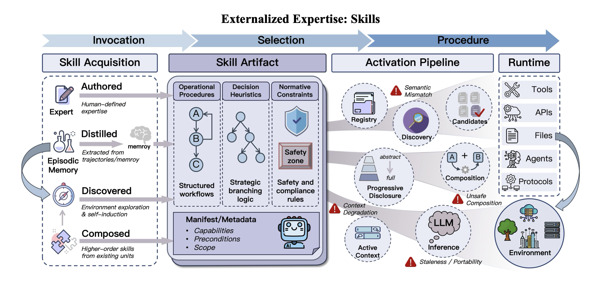

# 技能系统

**技能外部化**解决了智能体的程序负担问题。它将任务特定的知识打包成显式的可发现、可加载、可修订和可组合的人工制品，而不是要求模型在每次尝试任务时重新生成工作流、默认值和约束。

## 技能的三大组成部分

### 1. 操作程序

操作程序是任务骨架：将复杂工作分解为步骤、阶段、依赖关系和停止条件。

- **解决 LLM Agent 中的常见失败模式**：许多错误不是来自行动级别的无能，而是来自流程级别的不稳定
- **使执行更少即兴创作**：Agent 可以在中断后恢复，跨上下文或协作者移交工作，并在不从记忆重建整个工作流的情况下恢复状态
- **在长视野、多 Agent 和生产设置中最重要**，其中流程稳定性通常比瞬间流畅性更重要

### 2. 决策启发式

如果程序定义了执行的骨架，决策启发式管理分支处发生的情况。

- **实际任务很少作为固定管道展开**：工具失败、观察有噪声、几个局部合理的行动可能竞争
- **在这些条件下，良好的性能依赖于从经验中得出的实用经验法则**，而不是仅靠穷举搜索
- **捕获专家风格**：首先尝试什么，何时后退，什么证据足够，以及当多个路径仍然可行时偏好哪些权衡

### 3. 规范性约束

第三个组成部分是规范性约束：程序被视为可接受的条件。

- **工作流在技术上可能有效但仍然不合规、不安全或操作上错误**
- **在实际部署中，执行受到测试要求、范围限制、访问限制、可追溯性期望和特定领域操作规则的约束**
- **一旦外部化，这些约束就不再仅仅是事后评估标准**，而是成为技能本身的一部分
- **编码不仅是如何执行任务，还有如何在组织和安全边界内执行任务**

## 从执行原语到能力包

技能系统不是孤立出现的，但也不应与工具使用混为一谈。历史上，技能在两个早期发展的下游：可靠的行动调用和大规模行动选择。

### 阶段 1：原子执行原语

第一阶段为语言模型配备可靠的行动执行，例如通过结构化工具调用和函数调用接口。

- **关键成就**：稳定访问原子行动单元
- **不提供**：完成更广泛任务类别的显式可重用程序
- **单元是行动原语**，而不是技能

### 阶段 2：大规模原语选择

随着可调用工具数量的增长，问题从调用转移到选择。

- **主要进步**：模型可以检索、排名和动态在大型工具集合中选择
- **单元仍然是工具**，而不是程序
- **即使多步行为开始出现，完成任务类别的知识在很大程度上仍然隐含在提示或参数中**，而不是外部化为有界的可重用人工制品

### 阶段 3：作为打包专长的技能

第三阶段标志着抽象的进一步转变。中心问题不再是模型是否可以调用函数或检索适当的 API，而是完成一类任务所需的知识是否可以打包成可重用的能力单元。

**关键转换**：
- 能力不再主要被视为对工具或 API 的访问
- 能力越来越被视为打包的程序知识，可以跨任务加载、重用和组合
- 基础能力单元不再是孤立的工具调用，而是以可重用程序指导和执行结构为中心的更高级别人工制品

## 技能如何外部化

技能外部化不仅限于写下指令。在成熟的 Agent 系统中，关键问题是程序专长是否可以以在运行时可发现、可加载、可解释、可绑定和可执行的形式表示。

### 1. 规范

技能的外部化始于规范层。典型形式包括 SKILL.md、指令文件、清单或其他声明性规范人工制品。

**格式良好的技能规范应涵盖五类信息**：
1. 能力边界
2. 适用范围
3. 前置条件
4. 执行约束
5. 示例和反例

### 2. 发现

一旦技能成为显式人工制品，它们自然会引入注册和发现问题。

**发现机制**：
- 本地存储库、组织注册表或平台级市场
- 基于任务目标、上下文状态和环境条件的语义检索、结构化元数据、任务分解或这些策略的组合

### 3. 渐进式披露

技能的发现并不意味着其全部内容应立即注入到活动上下文中。

**分层形式**：
1. **最小级别** - 模型仅看到技能的名称和简要描述
2. **更深级别** - 公开清单类信息，如适用条件、所需的先决条件和主要约束
3. **最深级别** - 系统加载完整指南，包括详细程序、异常处理、示例和支持文件

### 4. 执行绑定

技能仍然是认知级别的描述，除非它连接到可执行行动。实际任务完成取决于绑定过程，该过程将技能的自然语言或结构化规范转换为当前环境中的具体操作。

### 5. 组合

技能系统的价值在技能可以组合时得到最充分的体现。与原子工具不同，技能可以参与更高级别的结构化协调。

**常见组合模式**：
- 串行执行
- 并行分工
- 条件路由
- 在更高级别技能中递归调用子技能

## 技能获取和演化

技能系统之所以重要，不仅因为它存储了创作的指令，还因为它提供了将成功行为转化为可重用专长的途径。

**四种获取途径**：

1. **创作** - 仍然是技能进入当前系统的最常见和最稳定的途径
2. **蒸馏** - 也可以从历史轨迹、实践痕迹或其他存储经验中诱导
3. **发现** - 除了手动创作和事后蒸馏，Agent 还可以通过环境交互自主发现新技能
4. **组合** - 最后，技能可以通过组合演化

## 边界条件

技能外部化改进了重用和治理，但它不能保证可靠性。

**主要边界条件**：
1. **语义对齐** - 模型可能遵循技能的字面措辞，同时仍然缺少任务的真正目标
2. **可移植性和陈旧性** - 技能在环境中的有效性不能被假设
3. **不安全组合** - 组合使技能更强大，但也创造了新的风险
4. **上下文相关的降级** - 技能执行可能在长时间交互中降级

## 相关研究

- [[Externalization-in-LLM-Agents|LLM Agent 中的外部化]]
- [[Harness-Engineering|Harness 工程]]
- [[Memory-Systems|记忆系统]]
- [[Agent-Protocols|智能体协议]]
