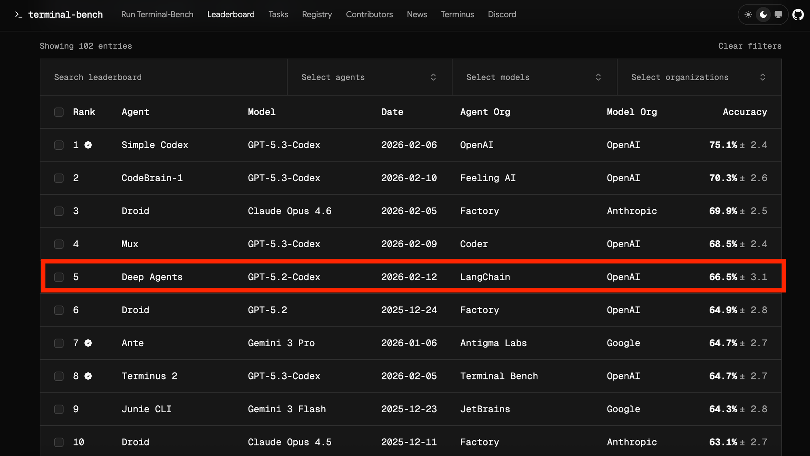
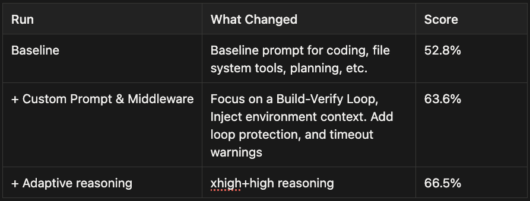
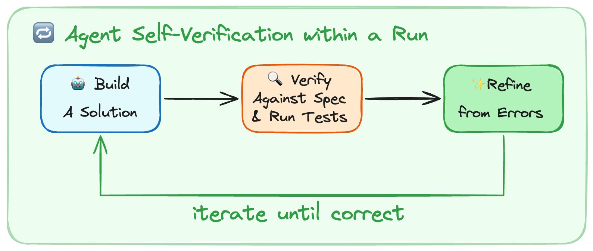
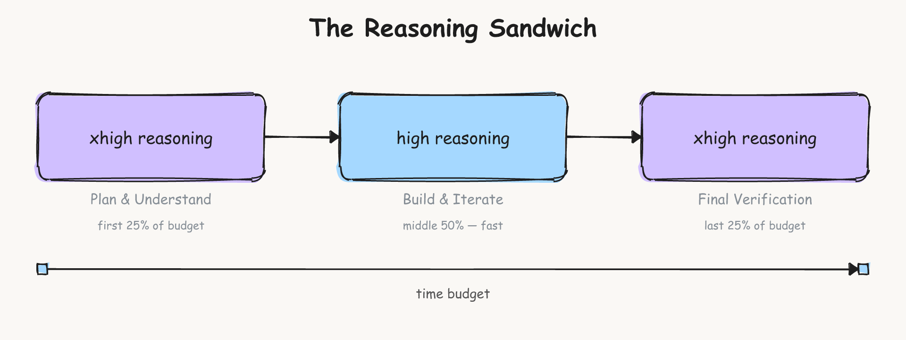

# LangChain Harness 工程实践

本文记录了 LangChain 团队如何通过仅改进 Harness，将他们的编码智能体在 Terminal Bench 2.0 上从第 30 名提升到第 5 名。核心要点：**自我验证和追踪帮助巨大**。

## 核心成果

- **基准测试**：Terminal Bench 2.0
- **提升幅度**：从 52.8 分提升到 66.5 分（+13.7 分）
- **模型保持不变**：gpt-5.2-codex
- **仅修改 Harness**：系统提示词、工具、中间件

---

## Harness 工程的目标

Harness 的目标是塑造模型固有的尖峰智力以适应我们关心的任务。**Harness 工程**是关于系统的，你在模型周围构建工具以优化目标，如任务性能、token 效率、延迟等。设计决策包括系统提示词、工具选择和执行流程。

但你应该如何改变 Harness 以改进智能体？

在 LangChain，他们使用 [Traces](https://docs.langchain.com/langsmith/observability-quickstart) 来大规模理解智能体失败模式。今天的模型在很大程度上是黑盒，它们的内部机制难以解释。但我们可以在文本空间中看到它们的输入和输出，然后将其用于我们的改进循环。

---

## 实验设置与 Harness 上的旋钮

使用 Terminal Bench 2.0（一个现在标准的基准测试来评估智能体编码）。它有 89 个任务，涵盖机器学习、调试和生物学等领域。使用 Harbor 来编排运行。它启动沙箱（Daytona），与智能体循环交互，并运行验证 + 评分。

每个智能体操作都存储在 LangSmith 中。它还包括延迟、token 计数和成本等指标。

### 我们可以转动的旋钮

智能体 Harness 有很多旋钮：系统提示词、工具、钩子/中间件、技能、子智能体委托、记忆系统等等。LangChain 有意压缩优化空间，专注于三个：**系统提示词、工具**和[**中间件**](https://docs.langchain.com/oss/python/langchain/middleware/overview)（他们对模型和工具调用周围钩子的术语）。

从默认提示词和标准工具+中间件开始。这在 GPT-5.2-Codex 上得分 52.8%。一个可靠的分数，刚好在今天排行榜前 30 名之外，但有增长空间。

### 追踪分析器技能

LangChain 希望追踪分析可重复，因此将其做成了智能体技能。这作为他们的**跨运行分析错误并对 Harness 进行改进**的方案。流程是：

1. 从 LangSmith 获取实验追踪
2. 生成并行错误分析智能体 → 主智能体综合发现 + 建议
3. 聚合反馈并对 Harness 进行有针对性的更改

这类似于 [boosting](https://en.wikipedia.org/wiki/Boosting_\(machine_learning\))，它专注于先前运行的错误。人类在第 3 步中可能非常有帮助（尽管不是必需的）来验证和讨论提议的更改。过度拟合到任务的更改对泛化不利，并可能导致其他任务的回归。

---

## 实际改进智能体性能的因素

自动化追踪分析允许 LangChain [调试智能体出错的地方](https://www.langchain.com/conceptual-guides/agent-observability-powers-agent-evaluation)。问题包括推理错误、不遵循任务指令、缺少测试和验证、超时等。

### 构建与自我验证

今天的模型是卓越的自我改进机器。

**自我验证允许智能体通过运行内的反馈自我改进。** 然而，它们没有自然倾向进入这个**构建-验证循环。**

最常见的失败模式是，智能体编写了一个解决方案，重新阅读自己的代码，确认看起来没问题，然后停止。测试是自主智能体编码的关键部分。它有助于测试整体正确性，同时为智能体提供信号以进行爬山优化。

LangChain 在系统提示词中添加了关于如何解决问题的指导：

1. **规划与发现**：阅读任务，扫描代码库，基于任务规范和如何验证解决方案构建初始计划。
2. **构建**：考虑验证来实现计划。如果测试不存在则构建测试，测试快乐路径和边缘情况。
3. **验证**：运行测试，阅读完整输出，与要求的内容进行比较（不是与你自己的代码比较）。
4. **修复**：分析任何错误，重新审视原始规范，并修复问题。

他们真正专注于测试，因为它在每次迭代中推动更改。发现除了提示词之外，确定性上下文注入有助于智能体验证它们的工作。使用 `PreCompletionChecklistMiddleware` 在智能体退出前拦截它，并提醒它对任务规范运行验证传递。这类似于 [Ralph Wiggum Loop](https://ghuntley.com/loop/)，其中一个钩子强制智能体在退出时继续执行，他们用它来进行验证。

---

### 为智能体提供关于其环境的上下文

Harness 工程的一部分是**构建一个良好的上下文工程交付机制。** Terminal Bench 任务带有目录结构、内置工具和严格的超时。

1. **目录上下文与工具**：`LocalContextMiddleware` 在智能体启动时运行以映射 `cwd` 和其他父/子目录。运行 `bash` 命令来查找工具，如 Python 安装。上下文发现和搜索容易出错，因此注入上下文减少了这个错误表面并帮助**将智能体引导到其环境中。**
2. **教智能体编写可测试的代码**：智能体不知道它们的代码需要如何可测试。添加提示词说它们的工作将根据编程测试来衡量，类似于提交代码时。例如，提到文件路径的任务规范应该完全遵循，以便解决方案在自动化评分步骤中工作。强调边缘情况的提示词有助于智能体避免只检查"快乐路径"情况。强制模型符合测试标准是避免随着时间推移"残渣 buildup"的强大策略。
3. **时间预算**：注入时间预算警告以推动智能体完成工作并转向验证。智能体在时间估计方面出了名的差，因此这种启发式在这种环境中有帮助。现实世界的编码通常没有严格的时间限制，但如果不添加任何约束知识，智能体就不会在时间范围内工作。

智能体对其环境、约束和评估标准了解得越多，它们就能越好地自主自我指导工作。

> **Harness 工程师的目的**：准备并交付上下文，以便智能体可以自主完成工作。

---

### 鼓励智能体退后一步并重新考虑计划

智能体一旦决定了一个计划可能会短视，导致"末日循环"，对相同的破碎方法进行小的变化（在某些追踪中 10+ 次）。

使用 `LoopDetectionMiddleware` 通过工具调用钩子跟踪每个文件的编辑计数。它在对同一文件进行 `N` 次编辑后添加诸如"……考虑重新考虑你的方法"之类的上下文。这可以帮助智能体从末日循环中恢复，尽管如果模型认为正确，它可以继续沿着相同的路径前进。

重要提示。这是一种设计启发式，围绕今天感知到的模型问题进行工程设计。随着模型改进，这些护栏可能会变得不必要，但今天有助于智能体正确且自主地执行。

---

### 选择在推理上花费多少计算

推理模型可以自主运行数小时，因此必须决定在每个子任务上花费多少计算。可以在每个任务上使用最大推理预算，但大多数工作可以从优化推理计算花费中受益。

Terminal Bench 超时限制创造了一个权衡。更多推理帮助智能体评估每个步骤，但可能燃烧超过 2 倍的 token/时间。`gpt-5.2-codex` 有 4 种推理模式：`low`、`medium`、`high` 和 `xhigh`。

发现推理有助于规划以完全理解问题，一些 Terminal Bench 任务非常困难。一个好的计划有助于更快地达到可行的解决方案。

后期验证也受益于更多推理以捕获错误并提交解决方案。作为一种启发式，选择 xhigh-high-xhigh"**推理三明治**"作为基线。

仅在 `xhigh` 运行得分很差，为 `53.9%`，因为智能体超时，相比之下在 `high` 运行得分为 `63.6%`。在推理预算拆分之间的试运行中没有大的差异，因此坚持使用将分数推到 `66.5%` 的方法。

模型的自然方法是**自适应推理**，在 [Claude](https://platform.claude.com/docs/en/build-with-claude/adaptive-thinking) 和 [Gemini](https://ai.google.dev/gemini-api/docs/thinking) 模型中看到，模型决定在推理上花费多少计算。

在多模型 Harness 中，平衡推理预算可以表现为使用大模型进行规划并[交接](https://docs.langchain.com/oss/python/langchain/multi-agent/handoffs)给小模型进行实现。

---

## 构建智能体 Harness 的实用要点

智能体的设计空间很大。以下是 LangChain 从实验和整体构建 deepagents 中得出的一些一般原则：

1. **代表智能体进行上下文工程**。上下文组装对于今天的智能体仍然很困难，尤其是在看不见的环境中。用目录结构、可用工具、编码最佳实践和问题解决策略等上下文引导模型，有助于减少搜索不佳和规划中可避免错误的错误表面。
2. **帮助智能体自我验证其工作**。模型偏向于它们第一个看似合理的解决方案。强烈提示它们通过运行测试和改进解决方案来验证其工作。这在没有人类在循环中的自主编码系统中尤其重要。
3. **追踪作为反馈信号**。追踪允许智能体自我评估和调试自己。一起调试工具和推理很重要（例如：模型走错路径是因为它们缺少工具或关于如何做某事的指令）。
4. **在短期内检测并修复坏模式**。今天的模型并不完美。Harness 设计者的工作是围绕今天的缺点进行设计，同时为未来更智能的模型做计划。盲目重试和不验证工作是很好的例子。这些护栏几乎肯定会随着时间推移而消失，但要在今天构建健壮的智能体应用程序，它们是值得实验的有用工具。
5. **为模型定制 Harness**。[Codex](https://developers.openai.com/cookbook/examples/gpt-5/codex_prompting_guide/) 和 [Claude](https://platform.claude.com/docs/en/build-with-claude/prompt-engineering/claude-prompting-best-practices) 提示指南显示模型需要不同的提示。使用 Claude Opus 4.6 的测试运行在早期 Harness 版本中得分 `59.6%`，有竞争力但比 Codex 差，因为他们没有与 Claude 运行相同的改进循环。许多原则可以推广，如良好的上下文准备和对验证的关注，但为你的任务运行几轮 Harness 迭代有助于跨任务最大化智能体性能。

在 Harness 设计中还有更多开放研究要做。有趣的途径包括多模型系统（Codex、Gemini 和 Claude 一起）、用于持续学习的记忆原语，以便智能体可以在任务上自主改进，以及跨模型测量 Harness 更改。

对于改进智能体的外层循环，LangChain 正在研究像 [RLMs](https://alexzhang13.github.io/blog/2025/rlm/) 这样的方法来更有效地挖掘追踪。他们将继续改进 Harness 并公开分享他们的研究。

---

## 相关研究

- [[Harness-Engineering|Harness 工程]]
- [[OpenAI-Codex-Harness-Engineering|OpenAI Codex Harness 工程]]
- [[Long-Running-Harness-Design|长运行应用的 Harness 设计]]
