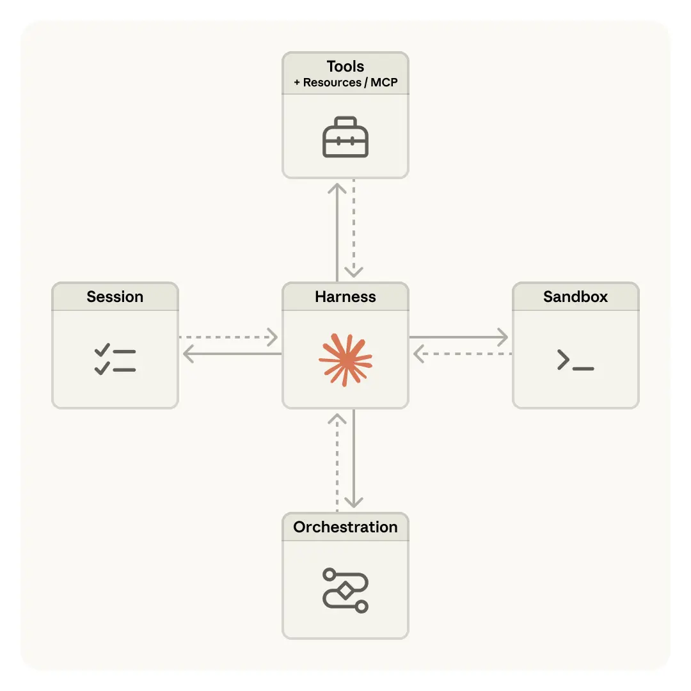
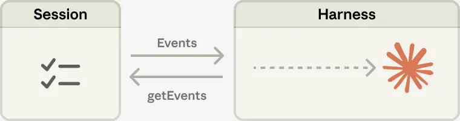

# Managed Agents：将大脑与手分离

本文描述了 Anthropic 如何构建 Managed Agents——一个在 Claude 平台中代表你运行长 horizon 智能体的托管服务。核心思想是通过一组旨在超越任何特定实现的接口来虚拟化智能体的组件。

## 核心论点

工程博客上的一个持续主题是如何[构建有效的智能体](https://www.anthropic.com/engineering/building-effective-agents)和[为长运行工作设计 Harness](https://www.anthropic.com/engineering/effective-harnesses-for-long-running-agents)。这项工作的一个共同线索是，Harness 编码了关于 Claude 自己不能做什么的假设。然而，这些假设需要经常被质疑，因为随着模型改进，它们可能会[过时](http://www.incompleteideas.net/IncIdeas/BitterLesson.html)。

仅举一个例子，在先前的工作中[发现](https://www.anthropic.com/engineering/harness-design-long-running-apps)，Claude Sonnet 4.5 会在感知到其上下文限制临近时过早结束任务——一种有时称为"上下文焦虑"的行为。通过向 Harness 添加上下文重置来解决这个问题。但是当在 Claude Opus 4.5 上使用相同的 Harness 时，发现这种行为已经消失了。重置变成了死重。

期望 Harness 继续演进。因此构建了 Managed Agents：Claude 平台中的一个托管服务，通过一组旨在超越任何特定实现的接口——包括今天运行的那些——来代表你运行长 horizon 智能体。

---

## 操作系统的启发

构建 Managed Agents 意味着解决计算中的一个老问题：如何为"尚未想到的程序"设计一个系统。几十年前，操作系统通过将硬件虚拟化为抽象——*进程、文件*——来解决这个问题，这些抽象足够通用，适用于尚不存在的程序。这些抽象比硬件更持久。`read()` 命令与它是访问 70 年代的磁盘组还是现代 SSD 无关。上面的抽象保持稳定，而下面的实现可以自由更改。

Managed Agents 遵循相同的模式。虚拟化了智能体的组件：会话（发生的一切的仅追加日志）、Harness（调用 Claude 并将 Claude 的工具调用路由到相关基础设施的循环）和沙箱（Claude 可以运行代码和编辑文件的执行环境）。这允许每个的实现被交换而不干扰其他的。对这些接口的形状有意见，但对它们后面运行的东西没有意见。

---

## 不要收养宠物

首先将所有智能体组件放入单个容器中，这意味着会话、智能体 Harness 和沙箱都共享一个环境。这种方法有好处，包括文件编辑是直接的系统调用，并且没有服务边界需要设计。

但是通过将所有东西耦合到一个容器中，遇到了一个老的基础设施问题：收养了一个[*宠物*](https://cloudscaling.com/blog/cloud-computing/the-history-of-pets-vs-cattle/)。在宠物与牛的类比中，宠物是一个命名的、手工照料的个体，你不能失去它，而牛是可互换的。在他们的情况下，服务器变成了那个宠物；如果容器失败，会话就丢失了。如果容器没有响应，必须护理它恢复健康。

护理容器意味着调试无响应的卡住会话。唯一的窗口是 WebSocket 事件流，但这不能告诉我们*哪里*出现了故障，这意味着 Harness 中的错误、事件流中的数据包丢弃或容器脱机都呈现相同的情况。为了弄清楚出了什么问题，工程师必须在容器内打开一个 shell，但因为该容器通常也持有用户数据，这种方法基本上意味着缺乏调试能力。

第二个问题是，Harness 假设 Claude 处理的任何东西都与它一起生活在容器中。当客户要求将 Claude 连接到他们的虚拟私有云时，他们必须要么将他们的网络与我们的对等，要么在他们自己的环境中运行我们的 Harness。Harness 中烘焙的假设在想要将其连接到不同的基础设施时变成了一个问题。

---

## 将大脑与手分离

到达的解决方案是将"大脑"（Claude 及其 Harness）与"手"（执行操作的沙箱和工具）和"会话"（会话事件的日志）两者分离。每个都成为一个对其他组件做出很少假设的接口，并且每个都可以独立失败或被替换。

**Harness 离开容器。** 将大脑与手分离意味着 Harness 不再生活在容器内。它像调用任何其他工具一样调用容器：`execute(name, input) → string`。容器变成了牛。如果容器死亡，Harness 将失败捕获为工具调用错误并将其传递回 Claude。如果 Claude 决定重试，可以使用标准配方重新初始化一个新容器：`provision({resources})`。不再需要护理失败的容器恢复健康。

**从 Harness 失败中恢复。** Harness 也变成了牛。因为会话日志位于 Harness 之外，Harness 中没有任何东西需要在崩溃后幸存。当一个失败时，可以用 `wake(sessionId)` 重新启动一个新的，使用 `getSession(id)` 取回事件日志，并从最后一个事件恢复。在智能体循环期间，Harness 使用 `emitEvent(id, event)` 写入会话，以保持事件的持久记录。

**安全边界。** 在耦合设计中，Claude 生成的任何不受信任的代码都在与凭证相同的容器中运行——因此提示注入只需要说服 Claude 读取自己的环境。一旦攻击者拥有这些令牌，他们就可以生成新的、不受限制的会话并将工作委托给它们。狭窄的范围是一个明显的缓解措施，但这编码了关于 Claude 不能用有限令牌做什么的假设——而 Claude 正变得越来越智能。结构性修复是确保令牌永远无法从 Claude 生成代码运行的沙箱访问到。

使用两种模式来确保这一点。Auth 可以与资源捆绑在一起，也可以保存在沙箱外的保险库中。对于 Git，使用每个存储库的访问令牌在沙箱初始化期间克隆存储库并将其连接到本地 git remote。Git `push` 和 `pull` 可以从沙箱内部工作，而智能体永远不会自己处理令牌。对于自定义工具，支持 MCP 并将 OAuth 令牌存储在安全保险库中。Claude 通过专用代理调用 MCP 工具；这个代理接受与会话关联的令牌。然后代理可以从保险库获取相应的凭证并调用外部服务。Harness 永远不会知道任何凭证。

---

## 会话不是 Claude 的上下文窗口

长 horizon 任务通常超过 Claude 上下文窗口的长度，解决这个问题的标准方法都涉及关于保留什么的不可逆决策。在关于上下文工程的[先前工作](https://www.anthropic.com/engineering/effective-context-engineering-for-ai-agents)中探索了这些技术。例如，压缩让 Claude 保存其上下文窗口的摘要，记忆工具让 Claude 将上下文写入文件，从而实现跨会话学习。这可以与上下文修剪配对，上下文修剪选择性地删除令牌，如旧工具结果或思考块。

但是选择性保留或丢弃上下文的不可逆决策可能导致失败。很难知道未来回合将需要哪些令牌。如果消息被压缩步骤转换，Harness 会从 Claude 的上下文窗口中删除压缩的消息，并且只有在存储时才能恢复这些消息。先前的工作[已经探索](https://arxiv.org/pdf/2512.24601)通过将上下文存储为生活在*上下文窗口之外*的对象来解决这个问题的方法。例如，上下文可以是 REPL 中的一个对象，LLM 通过编写代码来过滤或切片它来以编程方式访问它。

在 Managed Agents 中，会话提供了相同的好处，充当生活在 Claude 上下文窗口之外的上下文对象。但不是存储在沙箱或 REPL 中，上下文被持久存储在会话日志中。接口 `getEvents()` 允许大脑通过选择事件流的位置切片来询问上下文。该接口可以灵活使用，允许大脑从上次停止阅读的地方继续，倒回到特定时刻之前的几个事件以查看前导，或在特定操作之前重新阅读上下文。

任何获取的事件也可以在传递给 Claude 的上下文窗口之前在 Harness 中进行转换。这些转换可以是 Harness 编码的任何东西，包括上下文组织以实现高提示缓存命中率和上下文工程。分离了会话中可恢复的上下文存储和 Harness 中任意上下文管理的关注点，因为无法预测未来模型将需要什么特定的上下文工程。接口将该上下文管理推送到 Harness 中，并且只保证会话是持久的并且可用于询问。

---

## 多大脑，多手

**多大脑。** 将大脑与手分离解决了最早的客户投诉之一。当团队希望 Claude 针对他们自己 VPC 中的资源工作时，唯一的路径是将他们的网络与我们的对等，因为持有 Harness 的容器假设每个资源都在它旁边。一旦 Harness 不再在容器中，那个假设就消失了。相同的更改带来了性能回报。当最初将大脑放在容器中时，意味着许多大脑需要同样多的容器。对于每个大脑，在该容器被配置之前不能进行推理；每个会话都预先支付完整的容器设置成本。每个会话，即使是那些永远不会接触沙箱的会话，都必须克隆存储库、启动进程、从我们的服务器获取待处理事件。

那段死时间表示为首次 token 时间（TTFT），它衡量会话在接受工作和产生其第一个响应令牌之间等待的时间。TTFT 是用户最敏锐地*感受到*的延迟。

将大脑与手分离意味着容器仅在需要时才由大脑通过工具调用 `(execute(name, input) → string)` 来配置。因此，不需要立即容器的会话不必等待一个。一旦编排层从会话日志中提取待处理事件，推理就可以开始。使用这种架构，p50 TTFT 下降了大约 60%，p95 下降了超过 90%。扩展到许多大脑只意味着启动许多无状态 Harness，并且仅在需要时将它们连接到手。

**多手。** 还希望能够将每个大脑连接到多只手。在实践中，这意味着 Claude 必须推理许多执行环境并决定在哪里发送工作——这比在单个 shell 中操作更难的认知任务。从单个容器中的大脑开始，因为早期的模型没有能力做到这一点。随着智能的扩展，单个容器变成了限制而不是：当该容器失败时，失去了大脑正在伸向的每只手的状态。

将大脑与手分离使每只手成为一个工具，`execute(name, input) → string`：一个名称和输入进去，一个字符串返回。该接口支持任何自定义工具、任何 MCP 服务器和我们自己的工具。Harness 不知道沙箱是容器、电话还是 Pokémon 模拟器。并且因为没有手耦合到任何大脑，大脑可以将手彼此传递。

---

## 结论

面临的挑战是一个老问题：如何为"尚未想到的程序"设计一个系统。操作系统通过将硬件虚拟化为足够通用的抽象，适用于尚不存在的程序，已经持续了几十年。使用 Managed Agents，旨在设计一个适应 Claude 周围未来 Harness、沙箱或其他组件的系统。

Managed Agents 是一个具有相同精神的元 Harness，对 Claude 未来将需要的*特定*Harness 没有意见。相反，它是一个具有允许许多不同 Harness 的通用接口的系统。例如，Claude Code 是一个在任务中广泛使用的优秀 Harness。还表明特定任务的智能体 Harness 在狭窄领域表现出色。Managed Agents 可以容纳其中任何一个，随着时间推移匹配 Claude 的智能。

元 Harness 设计意味着对 Claude 周围的接口有意见：期望 Claude 将需要操纵状态（会话）和执行计算（沙箱）的能力。还期望 Claude 将需要扩展到多大脑和多手的能力。设计了接口，以便这些可以在长时间范围内可靠且安全地运行。但对 Claude 将需要的大脑或手的数量或位置没有做出任何假设。

---

## 相关研究

- [[Harness-Engineering|Harness 工程]]
- [[Long-Running-Harness-Design|长运行应用的 Harness 设计]]
