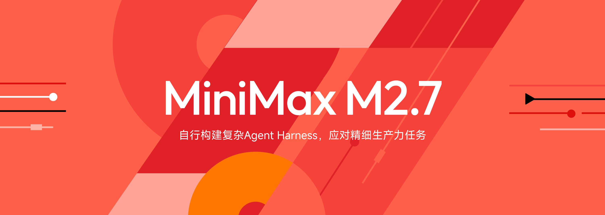
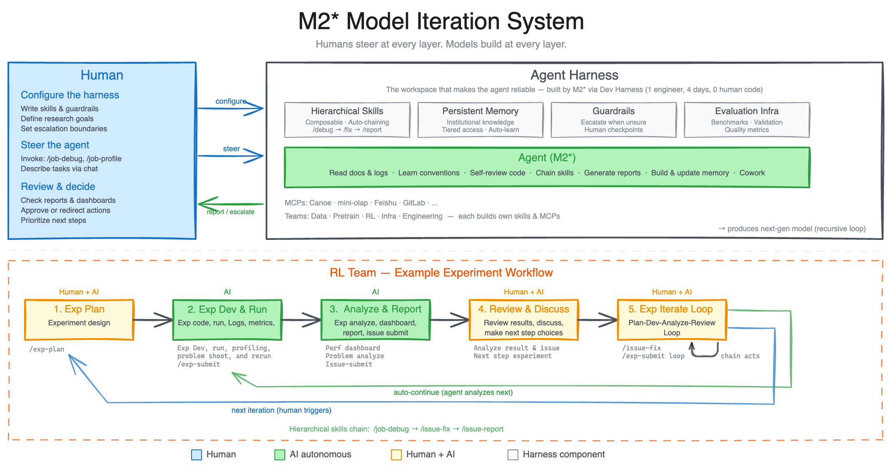
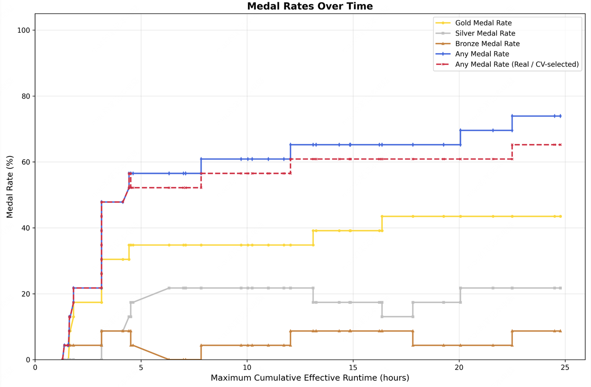
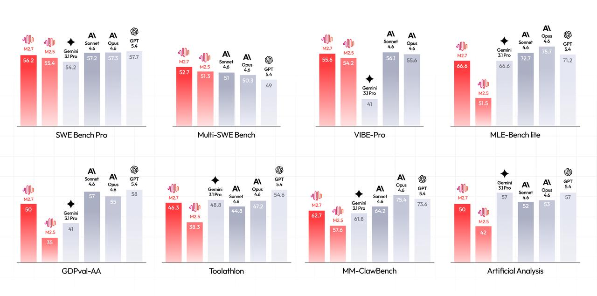

# MiniMax M2.7：开启模型的自我进化

本文介绍了 MiniMax M2.7——第一个模型深度参与迭代自己的模型。M2.7 能够自行构建复杂 Agent Harness，并基于 Agent Teams、复杂 Skills、Tool Search Tool 等能力，完成高度复杂的生产力任务。

## 核心亮点

在 M2 系列模型发布后的几个月，MiniMax 收到了大量热心用户的反馈和建议，这促使他们进一步加速模型的迭代效率。除了更加认真工作之外，能找到的唯一途径就是**开启模型和组织的自我进化**。

**关键声明**：MiniMax M2.7 是第一个模型深度参与迭代自己的模型。



---

## 三大核心能力

### 1. 真实软件工程能力

M2.7 在真实的软件工程中有优异的表现，包括端到端的完整项目交付，分析日志排查 Bug、代码安全，机器学习等。

**基准测试成绩**：
- **SWE-Pro**：56.22%，几乎接近 Opus 最好的水平
- **VIBE-Pro**：55.6%（端到端完整项目交付场景）
- **Terminal Bench 2**：57.0%（对复杂工程系统的深层理解）
- **SWE Multilingual**：76.5
- **Multi SWE Bench**：52.7

这一能力延伸到了端到端的完整项目交付场景——无论是 Web、Android、iOS 还是 Simulation 类需求，都可以直接交给 M2.7 完成。

**线上生产环境故障调试示例**：
面对实际的生产环境告警，M2.7 能：
- 关联监控指标与部署时间线做因果推理
- 对轨迹采样做统计分析并提出精准假设
- 主动连接数据库执行验证根因
- 定位到代码仓库中缺失的索引迁移文件
- 知道用非阻塞建索引先止血，再提 MR

> **结果**：从可观测性分析、数据库专业知识到 SRE 级别的决策判断——这不只是一个会写代码的模型，而是一个真正理解生产系统的模型。相比传统的人工排障流程，基于 M2.7，已多次将线上生产系统故障的恢复时间缩短到三分钟以内。

**原生 Agent Teams 能力**：
Agent Teams 对模型提出了范式级要求：角色边界、对抗性推理、协议遵循、行为分化——这些无法通过提示词，必须内化为模型的原生能力。Agent Teams 场景下，模型需要稳定锚定角色身份、主动挑战队友的逻辑与伦理盲区、在复杂状态机中自主决策。


---

### 2. 专业办公能力

在专业办公领域，提升了模型在各领域的专业知识和任务交付能力。

**基准测试成绩**：
- **GDPval-AA**：ELO 得分 1495-1500，为开源最高，仅次于 Opus 4.6、Sonnet 4.6 和 GPT5.4，超过了 GPT5.3
- **Toolathon**：46.3% 正确率，达到全球第一梯队水平
- **MM Claw**：62.7% 正确率，接近最新的 Sonnet 4.6

**核心办公能力**：
1. **专业知识与任务交付能力** - 模型需要具备各领域的专业知识，理解用户的需求
2. **与复杂环境的交互能力** - 泛化的日常场景意味着模型需要灵活适应各类上下文、调用各种 skills 和工具、并在长程交互中保持稳定的指令遵循

**Office 套件能力**：
- 对 Office 三件套 Excel/PPT/Word 的复杂编辑能力显著提升
- 能更好地完成多轮修改和高保真的编辑
- 既能够基于模版和 skills 直接生成文件，也能够遵从用户的交互指令，对已有的文件做多轮的高保真编辑
- 在 40 个复杂 skills (> 2000 Token) 的 case 上，仍能保持 97% 的 skills 遵循率

**Finance 领域示例**：
在阅读研报并建模公司未来营收的场景，M2.7 可以：
- 自主阅读公司的年报与业绩沟通会纪要
- 交叉比对多篇研报
- 独立设计假设并构建营收预测模型
- 再基于模版产出 PPT 和研究报告

从业者的评价是：产出物已经可以作为初稿直接进入后续工作流程。

---

### 3. 互动娱乐能力

M2.7 具备优秀的身份保持能力和情商，除了生产力使用外，给互动娱乐场景的创新也准备了空间。

在 OpenClaw 等 Agent 脚手架的使用过程中，不少用户在使用 Agent 完成工作的同时，还希望模型具备比较高的情商和复杂人设保持能力。在有人设的情况下，用户不再只是让模型机械完成任务，而是开始自然于与 Agent"相处"。

这促使 MiniMax 思考，产品与交互设计、内容创作、甚至娱乐体验的构建，都可以被 AI 原生驱动的可能性。这会让 Agentic 模型的使用从单纯的生产力能进一步拓展到互动娱乐。

**OpenRoom：Agent 交互系统**
基于此，MiniMax 构建了一个 Agent 交互系统 OpenRoom，它将 AI 互动置入一个万物皆可互动的 Web GUI 空间。在这里：
- 对话即驱动，实时产生视觉反馈与场景交互
- 角色可以主动地与环境交互
- 框架扩展性较高，能够随着模型 Agentic 能力的提升和社区的共建持续进化
- 探索出更多人与 Agent 之间全新的交互方式

**开源信息**：
- 项目地址：[github.com/MiniMax-AI/OpenRoom](https://github.com/MiniMax-AI/OpenRoom)
- 立即体验：[openroom.ai](https://openroom.ai/)
- 代码大部分也是 AI 写的

---

## 模型自我进化智能体

MiniMax 分享了一个内部让 M2 系列模型自我进化的实践，这也是对模型 Agent 能力边界的探索。

### 研究型 Agent Harness

Agent Harness 通常依赖复杂的 Skills、记忆系统和其他组件来提升模型对不同工作环境的适应能力。在此基础上，MiniMax 在 M2 的早期版本中，将其引导为一个**研究型 Agent Harness**——它能够与不同的研究项目组进行交互和协作。

**系统覆盖**：
- 数据流水线
- 训练环境
- 评测基础设施
- 跨团队协作
- 持久化记忆

让研究员可以驱动它来交付更好的模型。研究 Agent 驱动着产出下一代模型的迭代循环。研究员在每一层引导方向，模型在每一层负责构建。

### RL 场景示例

以一个 RL 场景为例：
1. 研究员从一个实验想法出发，与 Agent 展开讨论
2. Agent 协助进行文献调研，持续跟踪预设的实验规格，完成数据流水线及其他对接工作，并启动实验
3. 实验运行期间，它会自动监控和分析实验状态，并自动触发日志读取、问题排查、指标分析、代码修复、合并请求以及冒烟测试
4. 识别并配置那些细微但关键的变更

这些工作过去可能需要来自不同团队的多位同事协作完成，而现在研究员只需在关键决策和讨论时介入。这大幅加速了问题发现和实验迭代，从而更快地交付模型。

**结果**：在这个场景下，M2.7 能够胜任 30-50% 的工作流。



---

## Harness 自我进化

MiniMax 在迭代过程中也意识到，**模型自主迭代 harness 的能力也至关重要**。

内部的 harness 会：
- 自主收集反馈
- 建立内部任务的评测集
- 基于此不断迭代自己的 Agent 架构、Skills/MCP 实现和记忆机制
- 更好和更高效的完成任务

### 内部脚手架优化示例

让 M2.7 优化一个内部脚手架上模型的软件工程开发表现。M2.7 全程自主运行，执行以下迭代循环超过 100 轮：

```
分析失败轨迹 → 规划改动 → 修改脚手架代码 → 运行评测 → 对比结果 → 决定保留或回退
```

**M2.7 发现的有效优化**：
- 系统性搜索温度、频率惩罚、存在惩罚等采样参数的最优组合
- 为模型设计更具体的工作流指引（如修复后自动搜索其他文件中的相同 bug 模式）
- 在脚手架的 Agent Loop 中添加循环检测等优化

**最终结果**：在内部评测集上效果提升 30%。

---

## MLE Bench Lite 测试

MiniMax 相信，未来的 AI 自我进化会逐步向完全自动化过渡，包括完全自主的协调数据构建、模型训练、推理架构、评测等等。

**测试设置**：
- 用 M2.7 参与了 MLE Bench Lite 的 22 个机器学习任务测试
- 几乎囊括了研发的所有环节
- 设计和实现了一个简易的脚手架来引导 Agent 进行自主优化
- 核心模块包括：短时记忆、自反馈以及自优化三个模块
- 总共测试三次，每次有 24 小时来迭代进化

**具体运作方式**：
- Agent 完成每轮迭代后会形成一个短时记忆文件
- 同时对当前轮次的结果进行自反馈，从而给下一轮次提供潜在的优化方向
- 下一轮次基于所有历史轮次的记忆及自反馈链进行下一步的自优化

**成绩**：
- 最好的一次取得 9 枚金牌，5 枚银牌，1 枚铜牌
- 三次平均是 66.6% 的得牌率
- 此成绩仅次于：
  - Opus-4.6 (75.7%)
  - GPT-5.4 (71.2%)
- 和 Gemini-3.1 (66.6%) 持平



---

## 组织进化

基于上述能力，M2.7 也在显著加速 MiniMax 自身向一个 AI Native 组织的进化。



**产品可用性**：
- MiniMax M2.7 已在 MiniMax Agent 与开放平台上全量上线
- MiniMax Agent：[agent.minimaxi.com](https://agent.minimaxi.com/)
- API 服务：[platform.minimaxi.com](https://platform.minimaxi.com/)
- Coding Plan 订阅：[platform.minimaxi.com/subscribe/coding-plan](https://platform.minimaxi.com/subscribe/coding-plan)

> **Intelligence with Everyone.**

---

## 相关研究

- [[Harness-Engineering|Harness 工程]]
- [[Meta-Harness|元 Harness]]
