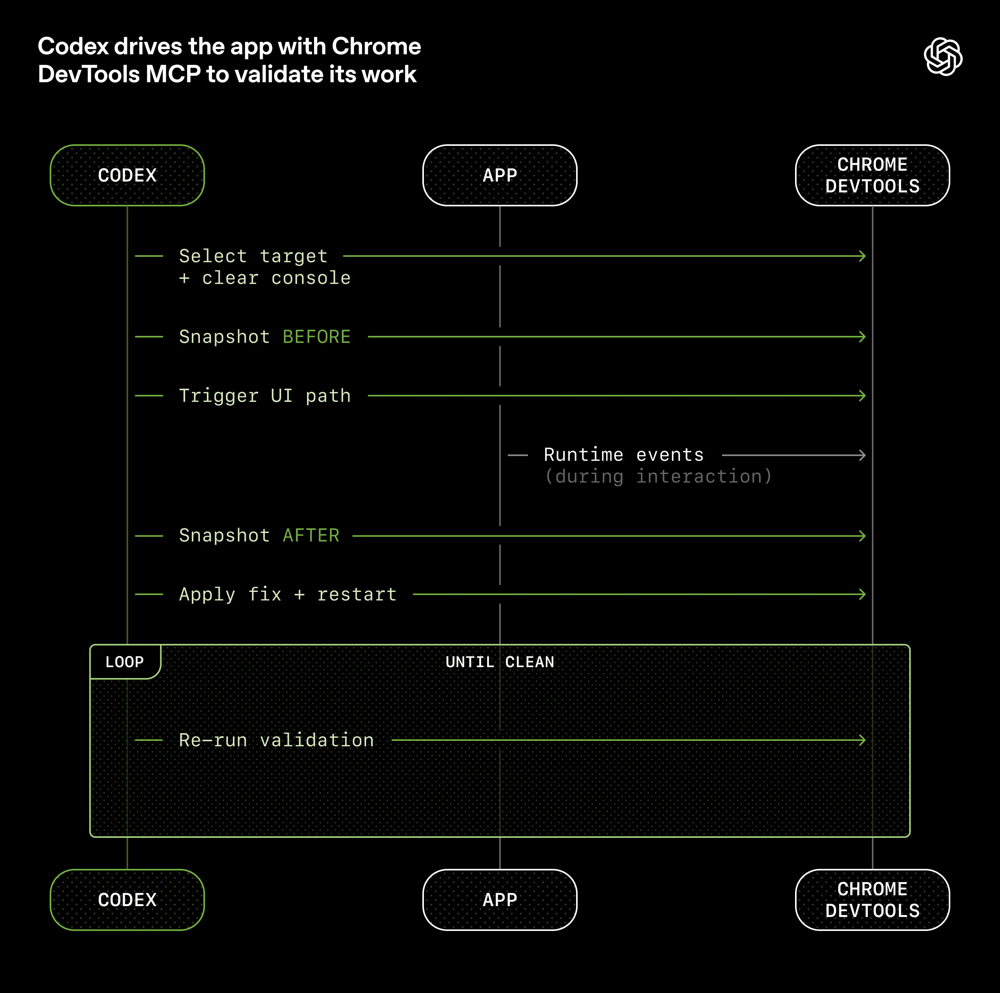
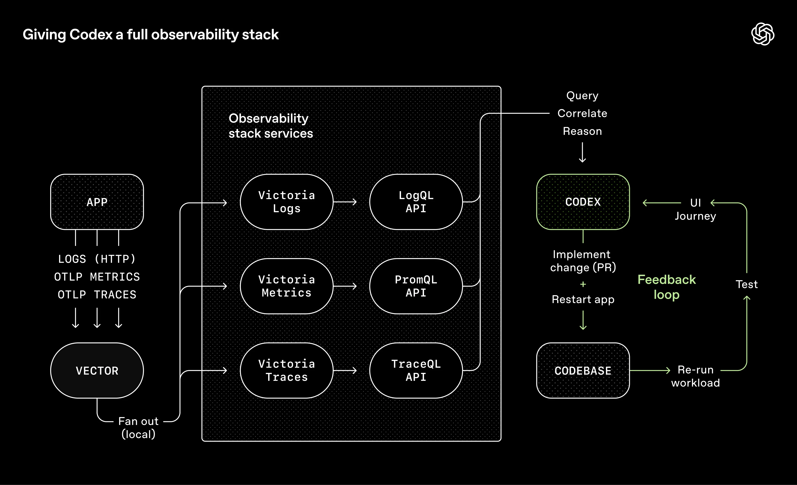
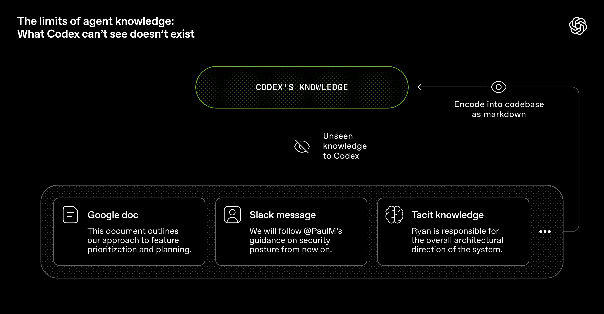
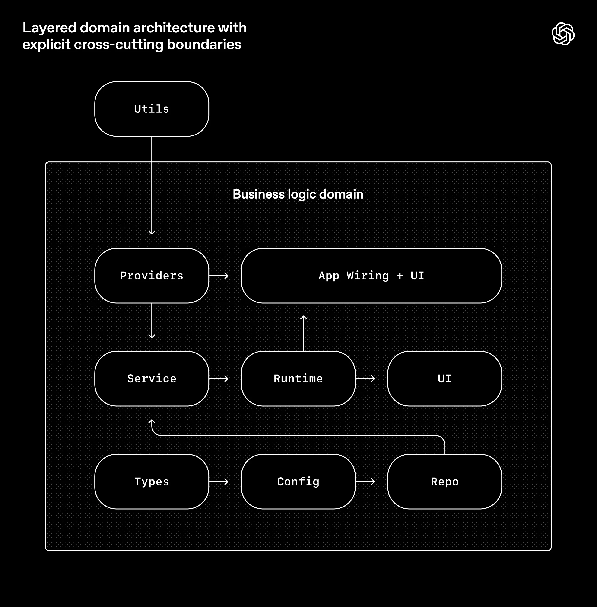

# OpenAI Codex Harness 工程

本文基于 OpenAI 团队的实践经验，探讨如何构建一个**完全由智能体生成代码**的产品开发环境。

## 核心实验

在过去五个月里，OpenAI 团队进行了一项实验：构建并交付一款软件产品的内部 beta 版，**其中没有一行代码是人工编写的**。

### 关键数据

- **代码量**：约一百万行代码
- **时间**：五个月（2025年8月下旬开始）
- **团队规模**：从 3 名工程师扩展到 7 名
- **PR 吞吐量**：平均每位工程师每天处理 3.5 个 PRs
- **效率提升**：只用了手工编写代码所需的大约 1/10 的时间

> **核心理念**：人类掌舵。智能体执行。

## 工程师角色的重新定义

由于缺乏人工编码的实践，**工程师工作的重点转向了系统、架构和杠杆作用**。

### 深度优先工作方式

将更大的目标拆解为更小的构建模块（设计、代码、评审、测试等），提示智能体去构建这些模块，并使用它们去解锁更复杂的任务。

> **关键洞见**：当事情进行不顺利时，解决方案基本上再也不会是"再努力一点"。因为取得进展的唯一方式是让 Codex 来完成工作，而人类工程师则总是介入这项任务并追问："究竟还需要什么样的能力，我们又该如何让这个能力对智能体来说既清晰可读又可强制执行？"

### 交互方式

人类几乎完全通过提示与系统交互：
- 工程师描述任务
- 运行智能体，允许其打开一个 Pull Request
- 指示 Codex 在本地审核其自身的更改
- 请求额外的特定智能体审查
- 对任何人工或智能体给出的反馈做出响应
- 循环往复，直到所有智能体审核人员都满意为止（这实际上是一个 [Ralph Wiggum 循环](https://ghuntley.com/loop/)）

## 提高应用程序的可读性

随着代码吞吐量的增加，瓶颈变成了人工 QA 能力。解决方案是：**令应用程序的 UI、日志和应用指标等内容对 Codex 直接可读**。

### Chrome DevTools 集成

- 令应用程序可以根据 git worktree 启动
- 将 Chrome DevTools 协议接入智能体运行时
- 创建用于处理 DOM 快照、屏幕截图和导航的技能
- 使 Codex 能够复现错误、验证修复，并直接推理 UI 的行为



### 完整的可观测性堆栈

日志、指标和追踪记录会通过一个本地可观测性堆栈展示给 Codex：
- 使用 LogQL 查询日志
- 使用 PromQL 查询指标
- 示例提示："确保服务启动在 800ms 内完成"或"这四个关键用户旅程中的任何跨度都不得超过两秒"



## 将代码仓库设为记录系统

情境管理是使智能体在大型和复杂任务中有效发挥作用的最大挑战之一。

> **早期经验教训**：要给 Codex 的是一张地图，而不是一本 1,000 页的说明书。

### "大型 AGENTS.md"方法的失败

尝试了"一个大型的 AGENTS.md"方法，结果失败了：

1. **情境是一种稀缺资源** - 一个巨大的指令文件会挤掉任务、代码和相关文档
2. **过多的指导反而变得无效** - 当一切都"重要"时，一切都不重要了
3. **它会立即腐烂** - 一本庞杂的手册会变成陈旧规则的坟场
4. **这很难核实** - 单个 blob 不适合进行机械检查

### 结构化知识库布局

因此，不再将 `AGENTS.md` 视为百科全书，而是将其视为**内容目录**：

```
AGENTS.md
ARCHITECTURE.md
docs/
├── design-docs/
│   ├── index.md
│   ├── core-beliefs.md
│   └── ...
├── exec-plans/
│   ├── active/
│   ├── completed/
│   └── tech-debt-tracker.md
├── generated/
│   └── db-schema.md
├── product-specs/
│   ├── index.md
│   ├── new-user-onboarding.md
│   └── ...
├── references/
│   ├── design-system-reference-llms.txt
│   ├── nixpacks-llms.txt
│   ├── uv-llms.txt
│   └── ...
├── DESIGN.md
├── FRONTEND.md
├── PLANS.md
├── PRODUCT_SENSE.md
├── QUALITY_SCORE.md
├── RELIABILITY.md
└── SECURITY.md
```

### 渐进式披露

智能体从一个小而稳定的切入点开始，并被指导下一步该去哪里查看，而不是一开始就被淹没。

- 专职的 linter 和 CI 作业会验证知识库的更新状况、是否已交叉链接且结构正确
- 定期运行的"doc-gardening"智能体会扫描过时或废弃文档，并发起修复用的 Pull Request

## 目标是智能体的可读性

由于该代码仓库完全由智能体生成，因此首先针对 Codex 的可读性进行了优化。

### 智能体知识的局限性

从智能体的角度来看，它在运行时无法在情境中访问的任何内容都是不存在的。

- 存储在 Google Docs、聊天记录或人们头脑中的知识都无法被系统访问
- 代码仓库本地的、已版本化的工件（代码、Markdown、模式、可执行计划）就是它所能看到的全部



### 将更多情境推送到仓库中

那次让团队在架构模式上达成一致的 Slack 讨论？如果智能体无法发现它，那么它就会像迟了三个月入职的新员工一样，对其一无所知。

> **关键原则**：倾向于选择那些可以完全内化于在仓库中进行推理的依赖项和抽象。对智能体来说，通常被称为"枯燥"的技术，由于其可组合性、API 稳定性和在训练集里的表现，往往更容易建立模型。

## 规范架构与品味

仅靠文档本身，是没法保持完全由智能体生成的代码库的连贯性的。

> **核心策略**：通过强制执行不变量，而非对实施过程进行微观管理，我们令智能体能够快速交付，而且不会削弱基础。

### 示例：在边界处解析数据形状

要求 Codex [在边界处解析数据形状](https://lexi-lambda.github.io/blog/2019/11/05/parse-don-t-validate/)，但不规定具体实现方式（模型似乎偏好 Zod，但没有指定特定库）。

### 分层领域架构

智能体在具有严格边界和可预测结构的环境中最为高效，因此围绕一个严格的架构模型构建了该应用：

- 每个业务域都划分为一组固定的层
- 依赖方向经过严格验证
- 仅允许有限的一组边
- 通过自定义的 linter 和结构测试机械地强制执行这些约束

规则：在每个业务领域内（例如应用设置），代码只能"向前"依赖于一组固定的层（Types → Config → Repo → Service → Runtime → UI）。横切关注点（认证、连接器、遥测、功能标志）通过一个单一的显式接口进入：Providers。



### 品味不变式

通过自定义的代码检查器和结构测试来强制执行规则，并辅以一小组"品味不变式"：

- 结构化日志记录
- 模式和类型的命名约定
- 文件大小限制
- 特定平台的可靠性要求

> **领导类比**：这类似于领导一个大型工程平台组织：在中央层面强制执行边界，在本地层面允许自主权。你非常重视界限、正确性和可重复性。在这些边界内，你允许团队或智能体在解决方案的表达方式上拥有很大的自由。

## 吞吐量改变了合并的理念

随着 Codex 的吞吐量增加，许多传统的工程规范变得不再有效。

- 代码仓库在运行过程中尽量减少阻塞合并门
- Pull Request 的生命周期很短
- 测试偶发失败通常通过后续重跑来解决，而不是无限期地阻碍进展

> **成本权衡**：在一个智能体吞吐量远超人类注意力的系统中，纠错成本低，而等待成本高。在低吞吐量环境中，这样做是不负责任的。而在这里，这通常是正确的选择。

## "智能体生成"实际上意味着什么

当说代码库是由 Codex 智能体生成的，指的是整个代码库：

- 产品代码与测试
- CI 配置和发布工具
- 内部开发者工具
- 文档和设计历史
- 评估框架
- 审阅评论和回复
- 管理代码仓库本身的脚本
- 生产仪表板定义文件

> **人类的角色**：人类始终参与其中，但工作的抽象层次与过去不同。我们优先处理工作，将用户反馈转化为验收标准，并对结果进行验证。当智能体遇到困难时，我们将其视为一个信号：识别缺失的内容 — 工具、指导与约束、文档 — 并将其反馈到代码仓库中，始终由 Codex 自己编写修复。

## 不断提高的自主水平

随着越来越多的开发环节被直接编码到系统中，该代码仓库最近跨过了一个重要门槛，使 Codex 能够端到端地驱动一个新功能。

给定一个提示，智能体现在可以：

1. 验证代码库的当前状态
2. 重现已报告的漏洞
3. 录制一个演示故障的视频
4. 实施修复措施
5. 通过运行应用程序来验证修复
6. 录制第二个视频，演示解决方案
7. 打开 Pull Request
8. 回应智能体和人类反馈
9. 检测并修复构建故障
10. 仅在需要判断时才交由人工处理
11. 合并更改

## 熵与垃圾收集

**完全自主的智能体也引入了新的问题**。Codex 会复现代码仓库中已存在的模式 — 甚至包括那些不均衡或不够理想的模式。随着时间的推移，这不可避免地导致漂移。

### 从人工清理到自动化循环

最初，人类是手动处理这个问题的：团队过去每周五（占一周的 20%）都要花时间清理"AI 残渣"。不出所料，那并不具备可扩展性。

### 黄金原则与循环清理流程

相反，开始将"黄金原则"直接编码到代码仓库中，并建立了一个循环清理流程：

1. **更倾向于使用共享的实用程序包**，而不是手工编写的辅助工具，以便将不变式集中管理
2. **不会使用"YOLO 式"探测数据** — 验证边界，或依赖类型化的 SDK
3. **定期运行一组后台 Codex 任务**，扫描偏差、更新质量等级，并发起有针对性的重构 Pull Request

> **垃圾收集类比**：技术债务就像一笔高息贷款：不断地以小额贷款的方式偿还债务，总比让债务不断累积，再痛苦地一次解决要好得多。

## 仍在学习的内容

显而易见的是：构建软件仍然需要纪律，但纪律更多地体现在支撑结构上，而不是代码上。保持代码库一致性的工具、抽象和反馈回路变得越发重要。

> **当前最棘手的挑战**：集中在设计环境、反馈回路和控制系统方面，帮助智能体实现我们的目标：大规模构建和维护复杂、可靠的软件。

## 相关研究

- [[Harness-Engineering|Harness 工程]]
- [[Long-Running-Harness-Design|长运行应用的 Harness 设计]]
- [[Externalization-in-LLM-Agents|LLM Agent 中的外部化]]
